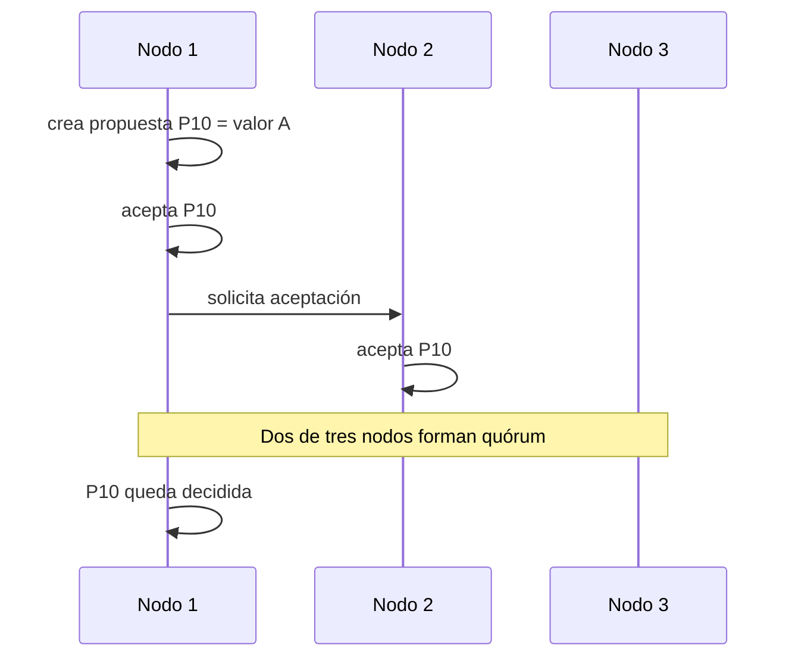

# 01. Consenso

## Concepto

Consenso es el problema de lograr que varios nodos acepten una decisión común
aunque algunos participantes fallen, la red retrase mensajes o distintas partes
del sistema observen el mundo en momentos diferentes.

La idea no es que todos los nodos estén felices, rápidos o sincronizados. La
idea mínima es más dura: si el sistema declara una decisión como válida, no debe
declarar otra decisión incompatible bajo las mismas reglas.

## Problema

En una sola máquina, guardar un valor parece trivial: se escribe en memoria y
se lee después. En un sistema distribuido esa memoria común no existe. Cada nodo
tiene estado local, recibe mensajes en orden distinto y puede fallar antes de
compartir lo que sabe.

Consenso aparece cuando el sistema necesita una respuesta única:

- qué entrada ocupa una posición de un log replicado;
- qué nodo coordina una ronda;
- qué configuración de clúster está vigente;
- qué operación se considera confirmada.

Si dos nodos aceptan historias incompatibles, el sistema deja de tener una
verdad operacional. A partir de ahí, cualquier capa superior empieza a construir
sobre arena: locks dobles, configuraciones divergentes, commits contradictorios
o lecturas que no se pueden explicar.

## Historia breve

El consenso es uno de los temas clásicos de sistemas distribuidos porque revela
una incomodidad fundamental: no basta con escribir código correcto en cada nodo.
También hay que razonar sobre lo que los nodos saben, lo que creen saber y lo
que no pueden distinguir.

Raft y Paxos son protocolos famosos porque dan estructura a este problema.
Antes de estudiarlos, conviene ver el núcleo desnudo: propuestas, votos,
quórums, fallas e historial.

## Diagrama



## Modelo educativo

El módulo `src/consensus.rs` implementa una sola ronda lógica. No implementa
Raft ni Paxos; modela el vocabulario mínimo:

- `NodeId`: identidad estable de nodo;
- `ProposalId`: identidad estable de propuesta;
- `ConsensusRound`: ronda con nodos, propuestas, votos, fallas e historial;
- `ConsensusEvent`: eventos observables;
- `ConsensusError`: errores explícitos del modelo.

La ronda decide con quórum mayoritario. En tres nodos, dos votos deciden. En
cuatro nodos, tres votos deciden.

## Implementación

Uso básico:

```rust
use rust_distributed_systems::consensus::{ConsensusRound, NodeId, ProposalId};

let mut round = ConsensusRound::new([NodeId(1), NodeId(2), NodeId(3)]);

round.propose(NodeId(1), ProposalId(10), "valor-a");
round.accept(NodeId(1), ProposalId(10))?;
round.accept(NodeId(2), ProposalId(10))?;

assert_eq!(round.decided_value(), Some("valor-a"));
# Ok::<(), rust_distributed_systems::consensus::ConsensusError>(())
```

El modelo conserva historial para que una decisión pueda explicarse después:

```rust
use rust_distributed_systems::consensus::{ConsensusEvent, ConsensusRound, NodeId, ProposalId};

let mut round = ConsensusRound::new([NodeId(1), NodeId(2), NodeId(3)]);

round.propose(NodeId(1), ProposalId(10), "valor-a");
round.accept(NodeId(1), ProposalId(10))?;
round.accept(NodeId(2), ProposalId(10))?;

assert_eq!(
    round.history().last(),
    Some(&ConsensusEvent::Decided {
        proposal: ProposalId(10),
    })
);
# Ok::<(), rust_distributed_systems::consensus::ConsensusError>(())
```

## Invariantes

El modelo protege estas reglas:

- cada nodo pertenece o no pertenece al grupo;
- un nodo caído no puede aceptar mensajes hasta recuperarse;
- una propuesta inexistente no puede recibir votos;
- un nodo no puede aceptar dos propuestas incompatibles en la misma ronda;
- un valor solo queda decidido al alcanzar quórum;
- el historial registra los eventos necesarios para explicar la decisión.

## Complejidad

Este modelo es deliberadamente pequeño:

- crear una ronda cuesta `O(n)` por el número de nodos;
- consultar el quórum cuesta `O(1)`;
- aceptar una propuesta cuesta `O(log n)` por las estructuras ordenadas usadas
  para nodos y votos;
- el historial crece linealmente con el número de eventos observados.

La implementación prioriza lectura y determinismo sobre microoptimizaciones.

## Ejemplos progresivos

### Básico

`examples/soluciones/consensus_basic_majority.rs` muestra la idea mínima: tres
nodos, una propuesta, dos aceptaciones y una decisión.

### Intermedio

`examples/soluciones/consensus_intermediate_failure.rs` muestra que un nodo
caído no puede votar hasta recuperarse.

### Avanzado

`examples/soluciones/consensus_advanced_conflict.rs` muestra que un nodo no
puede aceptar dos valores incompatibles dentro de la misma ronda.

### Caso real

`examples/soluciones/consensus_real_config.rs` interpreta la decisión como una
configuración activa de clúster.

## Alternativas

### Decisión centralizada

Un solo nodo decide. Es fácil de explicar y puede funcionar si ese nodo es
confiable, pero deja de servir cuando el coordinador falla o queda aislado.

### Mayoría sin memoria

Contar votos enseña quórums, pero no basta si los nodos pueden votar valores
incompatibles sin recordar lo anterior.

### Raft

Raft agrega líder, términos, log replicado y reglas de commit. Es más cercano a
sistemas operables, pero mezcla varias ideas que este capítulo separa.

### Paxos

Paxos formaliza propuestas, promesas y aceptaciones. Es poderoso, pero conviene
llegar a él después de entender por qué una mayoría simple no basta.

## Límites

Este capítulo no promete:

- tolerancia a fallas bizantinas;
- persistencia en disco;
- elección de líder completa;
- timeouts reales;
- redes asincrónicas arbitrarias;
- consenso de producción.

El límite es intencional. Primero se aprende la tensión; después se estudian
protocolos más fuertes.

## Casos de uso

Consenso aparece como pieza en:

- logs replicados;
- coordinación de líderes;
- cambios de configuración;
- locks distribuidos;
- commits coordinados;
- servicios que deben sobrevivir a fallas parciales sin aceptar historias
  contradictorias.

## Ejercicios

### Nivel 1: mayoría

Crea una ronda de cinco nodos. Propón un valor y verifica que dos votos todavía
no deciden, pero tres votos sí.

Solución sugerida: `examples/soluciones/consensus_basic_majority.rs`, adaptando
el tamaño del grupo.

### Nivel 2: falla explícita

Marca un nodo como caído antes de votar. Verifica que `accept` regresa
`NodeUnavailable`, recupera el nodo y confirma que ahora puede votar.

Solución sugerida: `examples/soluciones/consensus_intermediate_failure.rs`.

### Nivel 3: conflicto

Crea dos propuestas incompatibles y haz que un nodo acepte la primera. Después
intenta que acepte la segunda y verifica que el modelo devuelve
`ConflictingAcceptance`.

Solución sugerida: `examples/soluciones/consensus_advanced_conflict.rs`.

### Nivel 4: configuración de clúster

Modela una decisión que represente activar una nueva configuración de clúster.
Usa el historial para explicar qué nodos aceptaron la propuesta y cuándo quedó
decidida.

Solución sugerida: `examples/soluciones/consensus_real_config.rs`.

## Referencias internas

- `docs/00-glosario.md`
- `docs/00-convenciones-de-simulacion.md`
- `docs/superpowers/specs/2026-07-20-consensus-specification.md`

## Siguiente paso

El siguiente capítulo natural es Raft: toma el problema de consenso y lo vuelve
operacional mediante líder, términos y log replicado.
