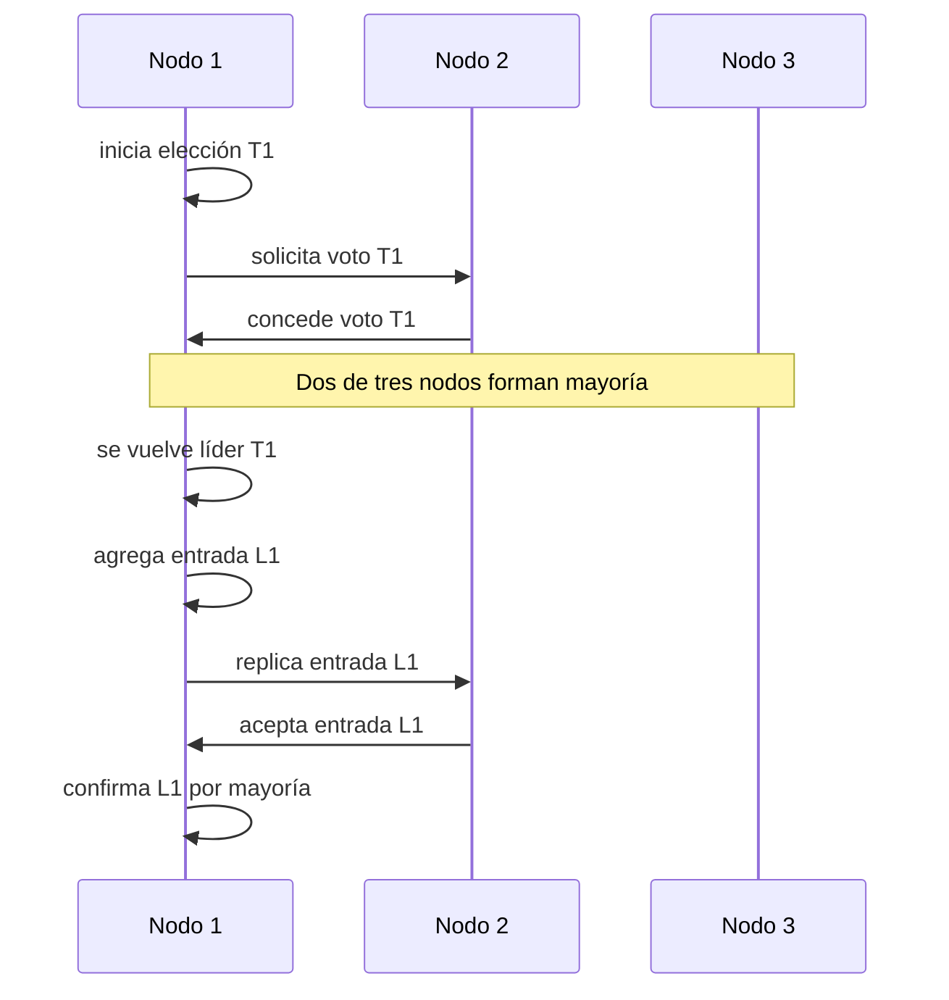

# 02. Raft

> **Estado:** benchmarked.
>
> El capítulo cuenta con especificación inicial, modelo Rust mínimo y tests de
> invariantes, ejemplos progresivos, ejercicios, soluciones ejecutables y
> diagrama Mermaid. También cuenta con benchmark educativo manual. Todavía no
> tiene revisión humana y no está marcado como `published`.

## Concepto

Raft es un protocolo de consenso diseñado para que un grupo de nodos mantenga
un log replicado mediante un líder, términos y reglas de confirmación por
mayoría.

La intuición es sencilla de decir y difícil de sostener correctamente: mientras
un líder legítimo coordina el clúster, las escrituras entran por él, se replican
a seguidores y solo se consideran confirmadas cuando una mayoría las reconoce.

## Problema

Consenso sobre un solo valor enseña quórums, propuestas e incompatibilidad.
Pero un servicio real no decide una sola vez. Decide una secuencia: comando 1,
comando 2, comando 3. Esa secuencia debe conservar orden incluso cuando hay
fallas.

Raft responde preguntas operacionales:

- qué nodo puede coordinar escrituras ahora;
- qué término vuelve obsoleto a un líder anterior;
- qué entradas pertenecen al log aceptado;
- cuándo una entrada pasa de recibida a confirmada;
- cómo se repara un seguidor con historial atrasado o incompatible.

Si estas preguntas no se responden explícitamente, el sistema puede aceptar dos
líderes aparentes, confirmar escrituras que una mayoría no conserva o perder la
capacidad de explicar qué historia deben obedecer los nodos recuperados.

## Diagrama



## Modelo educativo esperado

El modelo de este curso debe representar las piezas mínimas de Raft sin ocultar
el mecanismo detrás de red real, hilos ni dependencias externas:

- `NodeId`: identidad estable de nodo;
- `Term`: época lógica monótona;
- `Role`: rol local del nodo: follower, candidate o leader;
- `LogIndex`: posición dentro del log;
- `LogEntry`: comando y término que lo creó;
- `CommitIndex`: última entrada confirmada;
- solicitud de voto;
- respuesta de voto;
- replicación de entradas;
- respuesta de replicación.

El objetivo no es imitar todos los detalles de una implementación industrial. El
objetivo es tener un laboratorio determinista donde se puedan observar términos,
votos, liderazgo, divergencia de logs, reparación y commit por mayoría.

## Implementación

El módulo `src/raft.rs` implementa un clúster educativo determinista. Su API
expone una secuencia de pasos observables:

- iniciar elección;
- solicitar votos;
- finalizar elección si hay mayoría;
- agregar entradas desde el líder;
- replicar entradas hacia seguidores;
- confirmar entradas al alcanzar mayoría;
- preparar escenarios de log divergente.

Uso básico:

```rust
use rust_distributed_systems::raft::{LogIndex, NodeId, RaftCluster};

let mut cluster = RaftCluster::new([NodeId(1), NodeId(2), NodeId(3)]);

let term = cluster.start_election(NodeId(1))?;
cluster.request_vote(NodeId(2), NodeId(1), term)?;
cluster.finish_election(NodeId(1))?;

let index = cluster.append_entry(NodeId(1), "set x=1")?;
cluster.replicate_entry(NodeId(1), NodeId(2), index)?;
cluster.commit_entry(NodeId(1), index)?;

assert_eq!(index, LogIndex(1));
assert_eq!(cluster.committed_command(index), Some("set x=1"));
# Ok::<(), rust_distributed_systems::raft::RaftError>(())
```

## Invariantes

Raft existe para proteger historias. Por eso el capítulo debe hacer visibles
estas reglas:

- un nodo no reduce su término local;
- un nodo concede como máximo un voto por término;
- no puede haber dos líderes legítimos del mismo término con la misma mayoría;
- una entrada confirmada no puede ser reemplazada por otra incompatible;
- una entrada solo se confirma cuando alcanza mayoría;
- mensajes con términos obsoletos no pueden cambiar el liderazgo vigente;
- un seguidor no acepta una continuación de log si no coincide el prefijo
  esperado;
- toda transición relevante queda registrada en un historial explicable.

## Alternativas

### Líder fijo

Un coordinador permanente simplifica el camino feliz, pero convierte su caída en
un punto único de falla. No enseña cómo el sistema se recupera cuando el líder
desaparece.

### Mayoría por entrada

Decidir cada entrada como una ronda aislada ayuda a recordar el capítulo de
Consenso, pero deja difusa la operación de un log largo: elección, continuidad,
reparación y avance de commit.

### Raft

Raft es el modelo elegido para este capítulo porque organiza el problema con un
vocabulario práctico: término, líder, follower, candidato, log, commit y
mayoría. Esa forma permite escribir escenarios pequeños sin perder el vínculo
con sistemas reales.

### Paxos

Paxos aparecerá después. Es una alternativa importante, pero conviene llegar a
ella con el problema de log replicado ya visto desde una forma más operacional.

## Costos

Raft cambia simplicidad conceptual por coordinación explícita:

- una elección requiere intercambio de votos;
- una escritura requiere replicación desde el líder;
- una mayoría mejora seguridad, pero reduce disponibilidad si la partición deja
  pocos nodos juntos;
- reparar logs atrasados exige comparar índices y términos;
- conservar historial ayuda a explicar el sistema, pero crece con los eventos.

## Benchmark educativo

El benchmark del capítulo vive en `benches/raft_bench.rs` y se ejecuta con:

```bash
cargo bench --bench raft_bench
```

La salida imprime una tabla con cuatro mediciones:

- elección por mayoría;
- replicación y commit de una entrada;
- rechazo de voto duplicado en el mismo término;
- detección de conflicto de log.

Este benchmark no intenta demostrar rendimiento de una implementación real de
Raft. Usa `std::time::Instant`, `std::hint::black_box` y repeticiones simples
para conectar las operaciones del modelo con una medición local. El aprendizaje
está en identificar qué invariante protege cada operación.

Reglas de lectura:

- ejecutar varias veces antes de comparar;
- observar tendencias, no números absolutos;
- recordar que no hay red real, disco ni timeouts físicos;
- no usar estos números como referencia de producción.

## Ejemplos progresivos

### Básico

`examples/soluciones/raft_basic_election.rs` muestra la idea mínima: tres nodos,
un candidato, un voto adicional y una mayoría suficiente para elegir líder.

La lección no es que cualquier nodo pueda mandar. La lección es que el liderazgo
en Raft pertenece a un término y necesita votos observables.

### Intermedio

`examples/soluciones/raft_intermediate_commit.rs` muestra una escritura que
entra por el líder, se replica a un seguidor y queda confirmada al alcanzar
mayoría.

Antes de la réplica, la entrada existe en el líder, pero no está confirmada. Esa
diferencia entre "lo vi" y "el clúster lo aceptó" es una de las fronteras más
importantes del capítulo.

### Avanzado

`examples/soluciones/raft_advanced_log_conflict.rs` prepara un seguidor con un
log divergente y muestra que el modelo rechaza una replicación cuyo prefijo no
coincide.

La lección es que Raft no trata el log como una lista cualquiera. Índice y
término forman evidencia: si no coinciden, el seguidor no puede fingir que la
historia es compatible.

### Caso real

`examples/soluciones/raft_real_replicated_config.rs` interpreta una entrada del
log como una configuración de clúster. En cinco nodos, el líder necesita tres
réplicas, contándose a sí mismo, para confirmar el cambio.

Este caso conecta el modelo con sistemas reales: cambios de configuración,
operaciones administrativas, catálogos replicados o comandos que deben quedar
en una historia común.

## Modos de falla

El capítulo debe cubrir, como mínimo:

- candidato sin mayoría;
- líder aislado de la mayoría;
- mensaje de término viejo;
- seguidor con log atrasado;
- conflicto entre prefijos de log;
- entrada recibida por algunos nodos, pero no confirmada.

## Límites

Este capítulo no promete:

- almacenamiento persistente real;
- snapshots;
- membresía dinámica;
- lecturas linealizables completas;
- red real;
- temporizadores físicos;
- tolerancia a fallas bizantinas;
- API de producción.

Primero se aprende la estructura. Después se puede hablar de optimización,
persistencia, snapshots y operación real.

## Ejercicios

### Nivel 1: elección

Crea un clúster de tres nodos. Inicia elección desde `NodeId(2)`, concede un
voto desde `NodeId(3)` y verifica que el líder sea `NodeId(2)`.

Solución sugerida: `examples/soluciones/raft_basic_election.rs`, cambiando el
candidato.

### Nivel 2: commit explícito

Elige líder, agrega una entrada y verifica que `committed_command` sigue en
`None` antes de replicar. Después replica a un seguidor, confirma la entrada y
verifica el comando confirmado.

Solución sugerida: `examples/soluciones/raft_intermediate_commit.rs`.

### Nivel 3: conflicto de log

Prepara un seguidor con una entrada anterior usando `install_log_for_scenario`.
Luego intenta replicar una entrada distinta del líder en el mismo índice y
verifica que el modelo devuelve `RaftError::LogConflict`.

Solución sugerida: `examples/soluciones/raft_advanced_log_conflict.rs`.

### Nivel 4: configuración replicada

Modela una configuración de clúster como comando de log en cinco nodos. Verifica
que dos réplicas totales no alcanzan mayoría y que tres sí la alcanzan.

Solución sugerida: `examples/soluciones/raft_real_replicated_config.rs`.

## Referencias internas

- `docs/00-glosario.md`
- `docs/00-convenciones-de-simulacion.md`
- `docs/01-consenso.md`
- `diagrams/02-raft.mmd`
- `docs/superpowers/specs/2026-07-20-raft-specification.md`

## Siguiente paso

El siguiente paso natural es revisar Raft con criterio humano antes de decidir
si se agregan correcciones o si el capítulo puede avanzar hacia publicación.
