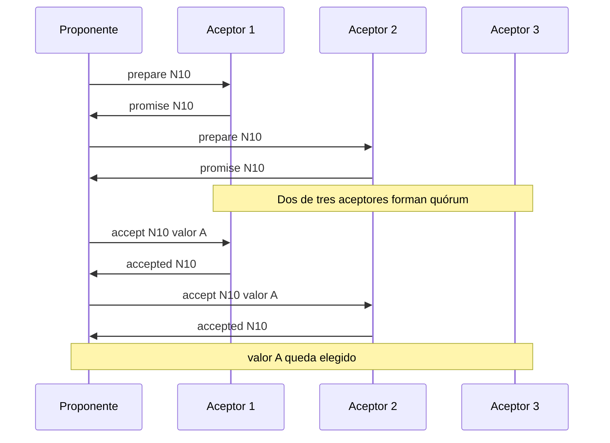

# 03. Paxos

> **Estado:** tested.
>
> El capítulo cuenta con especificación inicial, modelo Rust mínimo y tests de
> invariantes, ejemplos progresivos, ejercicios, soluciones ejecutables y
> diagrama Mermaid. Todavía no tiene benchmark ni revisión humana.

## Concepto

Paxos es una forma de lograr consenso mediante propuestas numeradas, promesas de
aceptores y aceptación por quórum. Su núcleo no depende de un líder estable: la
seguridad nace de que los aceptores recuerdan qué prometieron y qué aceptaron.

La frase corta es esta: Paxos permite que varios proponentes compitan sin que el
sistema pueda elegir dos valores incompatibles.

## Problema

En un sistema distribuido, una propuesta puede llegar tarde, duplicada o después
de otra propuesta más nueva. Si los nodos aceptan cualquier valor que llegue con
mayoría momentánea, dos grupos podrían creer que decidieron historias
incompatibles.

Paxos responde preguntas más formales que Raft:

- qué hace que una propuesta vieja deje de ser válida;
- qué memoria mínima debe conservar un aceptor;
- cuándo una mayoría obliga a respetar un valor previo;
- cómo se mantiene seguridad aunque varios proponentes compitan;
- por qué una decisión futura no puede contradecir una decisión ya elegida.

## Diagrama



## Modelo educativo esperado

El modelo de este curso debe representar Paxos clásico para una sola decisión,
sin red real, hilos, disco ni timeouts físicos:

- `NodeId`: identidad estable de participante;
- `ProposalNumber`: número ordenable de propuesta;
- `ProposalValue`: valor educativo propuesto;
- `AcceptorState`: promesa más alta y aceptación previa;
- `PrepareRequest`: solicitud de promesa;
- `Promise`: respuesta de un aceptor;
- `AcceptRequest`: solicitud de aceptar un valor;
- `Accepted`: aceptación observable;
- `PaxosRound`: escenario determinista para enseñar quórums.

El objetivo no es esconder Paxos detrás de una API cómoda. El objetivo es que el
alumno vea por qué una promesa existe, qué obliga a adoptar un valor previo y
cómo se decide por intersección de mayorías.

## Implementación

El módulo `src/paxos.rs` implementa una sola decisión Paxos con pasos
deterministas:

- solicitar promesas con `prepare`;
- rechazar propuestas viejas;
- reportar aceptaciones previas;
- elegir un valor seguro con `safe_value`;
- aceptar propuestas;
- declarar un valor elegido por mayoría.

Uso básico:

```rust
use rust_distributed_systems::paxos::{NodeId, PaxosRound, ProposalNumber};

let mut round = PaxosRound::new([NodeId(1), NodeId(2), NodeId(3)]);
let proposal = ProposalNumber(10);

round.prepare(NodeId(1), NodeId(1), proposal)?;
round.prepare(NodeId(1), NodeId(2), proposal)?;
round.accept(NodeId(1), proposal, "valor-a")?;
round.accept(NodeId(2), proposal, "valor-a")?;

assert_eq!(round.chosen_value(), Some("valor-a"));
# Ok::<(), rust_distributed_systems::paxos::PaxosError>(())
```

## Invariantes

Paxos protege seguridad antes que comodidad. El capítulo debe hacer visibles
estas reglas:

- todo número de propuesta tiene orden total;
- un aceptor no reduce la mayor propuesta prometida;
- un aceptor rechaza propuestas menores que su promesa vigente;
- una aceptación previa queda disponible para promesas futuras;
- un proponente que observa aceptaciones previas adopta el valor de la propuesta
  aceptada con mayor número;
- un valor solo queda elegido si lo acepta una mayoría;
- dos mayorías dentro del mismo conjunto de aceptores deben intersectarse;
- si un valor queda elegido, otro incompatible no puede quedar elegido después;
- el historial permite explicar promesas, rechazos, aceptaciones y decisión.

## Alternativas

### Mayoría sin promesas

Contar votos enseña quórums, pero no basta. Sin promesas, una propuesta nueva y
una vieja pueden cruzarse de forma que parezcan válidas dos historias
incompatibles.

### Coordinador único

Un coordinador evita competencia en el camino feliz, pero mueve el problema
hacia la confiabilidad de ese coordinador. Es una idea útil para comparar con
Raft, no para explicar Paxos clásico.

### Paxos clásico

Paxos clásico es el modelo elegido para este capítulo porque separa preparación
y aceptación. Esa separación permite estudiar seguridad con precisión: primero
se obtiene una mayoría de promesas, después se propone el valor seguro.

### Multi-Paxos

Multi-Paxos reduce costo cuando hay muchas decisiones y un coordinador estable,
pero conviene llegar a él después de entender una sola decisión clásica.

## Costos

Paxos hace visible el precio de la seguridad:

- una decisión clásica necesita preparación y aceptación;
- propuestas competidoras pueden provocar rechazos y reintentos;
- cada aceptor debe recordar su mayor promesa y su aceptación previa;
- una mayoría preserva seguridad, pero limita disponibilidad durante
  particiones;
- un proponente puede terminar proponiendo un valor distinto al que quería si
  encuentra una aceptación previa.

## Ejemplos progresivos

### Básico

`examples/soluciones/paxos_basic_majority.rs` muestra la ruta mínima: dos
promesas, dos aceptaciones y un valor elegido en tres aceptores.

La lección es que una aceptación aislada no decide. La decisión aparece cuando
una mayoría acepta la misma propuesta y valor.

### Intermedio

`examples/soluciones/paxos_intermediate_stale_proposal.rs` muestra un aceptor
que ya prometió una propuesta mayor y rechaza una propuesta vieja.

La lección es que la promesa no es decoración: es la memoria que evita que el
sistema regrese a una historia anterior.

### Avanzado

`examples/soluciones/paxos_advanced_adopted_value.rs` muestra un proponente que
quería usar un valor nuevo, pero descubre una aceptación previa y adopta el valor
seguro.

La lección es incómoda y esencial: en Paxos, el proponente no siempre decide el
valor que quería; decide el valor que preserva seguridad.

### Caso real

`examples/soluciones/paxos_real_config_decision.rs` interpreta el valor elegido
como una configuración de clúster. En cinco aceptores, tres aceptaciones eligen
la configuración.

Este caso conecta Paxos con decisiones de coordinación: configuración activa,
comando administrativo, versión de catálogo o cualquier valor que deba quedar
como verdad común.

## Modos de falla

El capítulo debe cubrir, como mínimo:

- `prepare` con número viejo;
- `accept` rechazado por una promesa mayor;
- competencia entre dos proponentes;
- adopción obligatoria de valor previo;
- partición sin quórum;
- mensajes duplicados que no cambian la decisión.

## Límites

Este capítulo no promete:

- Multi-Paxos completo;
- liderazgo estable;
- leases;
- persistencia real;
- recovery de producción;
- red real;
- relojes físicos;
- tolerancia a fallas bizantinas;
- API de producción.

Primero se aprende por qué Paxos es seguro. Después se puede estudiar cómo se
vuelve práctico.

## Ejercicios

### Nivel 1: mayoría

Crea una ronda con tres aceptores. Envía `prepare` a dos aceptores, acepta el
mismo valor en uno y verifica que todavía no hay decisión. Acepta en el segundo
y verifica que el valor queda elegido.

Solución sugerida: `examples/soluciones/paxos_basic_majority.rs`.

### Nivel 2: propuesta vieja

Haz que un aceptor prometa `ProposalNumber(20)`. Después intenta preparar
`ProposalNumber(10)` contra el mismo aceptor y verifica que el modelo devuelve
`PaxosError::StaleProposal`.

Solución sugerida: `examples/soluciones/paxos_intermediate_stale_proposal.rs`.

### Nivel 3: valor seguro

Prepara y acepta parcialmente un valor. Luego inicia una propuesta mayor,
recolecta promesas y usa `PaxosRound::safe_value` para confirmar que el nuevo
proponente debe adoptar el valor previamente aceptado.

Solución sugerida: `examples/soluciones/paxos_advanced_adopted_value.rs`.

### Nivel 4: configuración elegida

Modela una configuración de clúster como valor de Paxos en cinco aceptores.
Verifica que dos aceptaciones no deciden y que tres aceptaciones sí.

Solución sugerida: `examples/soluciones/paxos_real_config_decision.rs`.

## Referencias internas

- `docs/00-glosario.md`
- `docs/00-convenciones-de-simulacion.md`
- `docs/01-consenso.md`
- `docs/02-raft.md`
- `diagrams/03-paxos.mmd`
- `docs/superpowers/specs/2026-07-20-paxos-specification.md`

## Siguiente paso

El siguiente paso natural es agregar benchmark educativo para observar costos de
preparación, aceptación, rechazo de propuesta vieja y adopción de valor previo.
