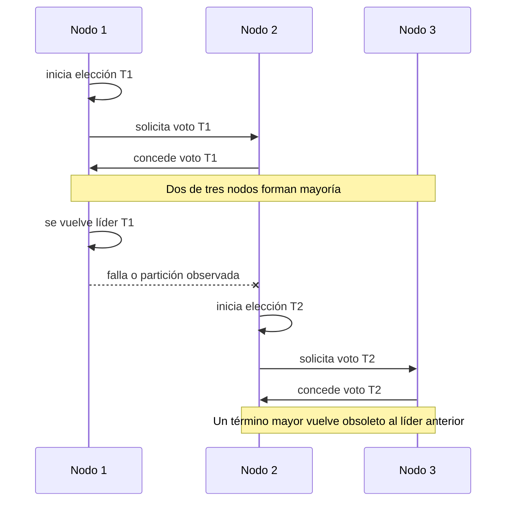

# 04. Elección de líder

> **Estado:** tested.
>
> El capítulo cuenta con especificación inicial, modelo Rust mínimo y tests de
> invariantes, ejemplos progresivos, ejercicios, soluciones ejecutables y
> diagrama Mermaid. Todavía no tiene benchmark ni revisión humana.

## Concepto

Elección de líder es el mecanismo mediante el cual un grupo de nodos decide qué
nodo coordina temporalmente una tarea. El líder no es una verdad absoluta: es
una autoridad acotada por un término, votos e invariantes.

La pregunta central no es "quién manda", sino "bajo qué evidencia podemos
aceptar que este nodo coordina ahora".

## Problema

En sistemas distribuidos no hay una vista global perfecta. Un nodo puede estar
lento, aislado o caído; otro nodo puede observar mensajes viejos; una partición
puede hacer que dos grupos crean tener autoridad.

Elección de líder responde preguntas prácticas:

- quién coordina una ronda;
- qué hace obsoleto a un líder anterior;
- cuántos votos bastan para reconocer liderazgo;
- qué ocurre si un votante ya eligió a otro candidato;
- cómo explicar por qué una elección ganó o falló.

## Diagrama



## Modelo educativo esperado

El modelo de este curso debe representar una elección determinista por mayoría:

- `NodeId`: identidad estable de nodo;
- `ElectionTerm`: época lógica monótona;
- `LeadershipRole`: follower, candidate o leader;
- `LeaderElection`: escenario con nodos, términos, votos, disponibilidad e
  historial;
- solicitud de voto;
- concesión o rechazo de voto;
- elección por quórum;
- rechazo de mensajes obsoletos.

El objetivo no es construir Raft otra vez. El objetivo es aislar la idea de
autoridad temporal para entender qué significa "este nodo puede coordinar
ahora" sin esconder las fallas.

## Implementación

El módulo `src/leader_election.rs` implementa una elección determinista por
mayoría. Su API expone una secuencia pequeña:

- iniciar elección;
- conceder votos;
- finalizar elección cuando hay quórum;
- marcar nodos no disponibles;
- recuperar nodos;
- consultar líder, rol e historial.

Uso básico:

```rust
use rust_distributed_systems::leader_election::{LeaderElection, NodeId};

let mut election = LeaderElection::new([NodeId(1), NodeId(2), NodeId(3)]);

let term = election.start_election(NodeId(1))?;
election.grant_vote(NodeId(2), NodeId(1), term)?;
election.finish_election(NodeId(1))?;

assert_eq!(election.leader(), Some(NodeId(1)));
# Ok::<(), rust_distributed_systems::leader_election::LeaderElectionError>(())
```

## Invariantes

El capítulo debe hacer visibles estas reglas:

- cada nodo tiene identidad única;
- un término no retrocede;
- un nodo concede como máximo un voto por término;
- un candidato necesita mayoría para ser líder;
- no hay dos líderes legítimos del mismo término sobre la misma mayoría;
- un término viejo no cambia liderazgo vigente;
- un nodo no disponible no puede votar;
- el historial explica inicios de elección, votos, rechazos y liderazgo.

## Alternativas

### Líder fijo

Un coordinador permanente simplifica el camino feliz, pero convierte su caída en
un punto único de falla.

### Mayor identificador activo

Elegir al nodo con identificador más alto es simple, pero depende de detectar
actividad correctamente. Una red lenta puede parecer una falla.

### Votación por mayoría

Es el modelo elegido para este capítulo. Conecta con Raft, pero conserva un
alcance menor: términos, votos, disponibilidad y quórum.

### Detector externo

Un servicio externo puede decidir liderazgo, pero oculta el mecanismo que el
curso necesita estudiar.

## Costos

La elección de líder tiene precio:

- cada elección intercambia mensajes;
- mayoría mejora seguridad, pero limita disponibilidad;
- cada nodo debe recordar votos por término;
- fallas y recuperaciones agregan ruido operacional;
- cambios frecuentes de líder pueden frenar el progreso.

## Ejemplos progresivos

### Básico

`examples/soluciones/leader_election_basic_majority.rs` muestra la ruta mínima:
tres nodos, un candidato, un voto adicional y una mayoría suficiente para
elegir líder.

La lección es que liderazgo no significa "empecé primero". Un candidato solo se
convierte en líder cuando existe evidencia suficiente dentro del término.

### Intermedio

`examples/soluciones/leader_election_intermediate_unavailable.rs` muestra que un
nodo no disponible no puede votar hasta recuperarse.

La lección es que disponibilidad y seguridad se tensan entre sí. Ignorar nodos
caídos aumenta progreso aparente, pero permitir que voten sin evidencia haría
imposible explicar la elección.

### Avanzado

`examples/soluciones/leader_election_advanced_double_vote.rs` muestra que un
votante no puede apoyar a dos candidatos distintos dentro del mismo término.

La lección es central: el voto por término es memoria de seguridad. Sin esa
memoria, dos candidatos podrían reunir mayorías aparentes sobre observaciones
incompatibles.

### Caso real

`examples/soluciones/leader_election_real_failover.rs` interpreta la elección
como relevo operativo: un líder queda no disponible y otro nodo gana liderazgo
en un término mayor.

Este caso conecta el modelo con coordinadores reales de clúster, control planes,
scheduler primario, réplica primaria de una base de datos o cualquier servicio
que necesita una autoridad temporal para avanzar.

## Modos de falla

El capítulo debe cubrir, como mínimo:

- candidato sin mayoría;
- doble voto en el mismo término;
- voto desde nodo no disponible;
- mensaje de término viejo;
- líder obsoleto;
- recuperación de nodo después de una elección.

## Límites

Este capítulo no promete:

- consenso completo;
- leases con relojes reales;
- persistencia en disco;
- detección perfecta de fallas;
- red real;
- tolerancia a fallas bizantinas;
- API de producción.

Primero se aprende la autoridad temporal. Después se estudia cómo se combina
con logs, locks, clocks y transacciones.

## Ejercicios

### Nivel 1: mayoría

Crea una elección con tres nodos. Inicia una candidatura con `NodeId(1)`,
concede un voto desde `NodeId(2)` y verifica que `NodeId(1)` queda como líder
después de finalizar la elección.

Solución sugerida:
`examples/soluciones/leader_election_basic_majority.rs`.

### Nivel 2: nodo no disponible

Marca `NodeId(2)` como no disponible antes de votar. Verifica que el modelo
devuelve `LeaderElectionError::NodeUnavailable`. Después recupera el nodo y
confirma que puede votar.

Solución sugerida:
`examples/soluciones/leader_election_intermediate_unavailable.rs`.

### Nivel 3: doble voto

Haz que `NodeId(2)` vote por `NodeId(1)` en un término. Después intenta que el
mismo nodo vote por `NodeId(3)` en el mismo término y verifica que el modelo
devuelve `LeaderElectionError::AlreadyVoted`.

Solución sugerida:
`examples/soluciones/leader_election_advanced_double_vote.rs`.

### Nivel 4: relevo de líder

Elige líder a `NodeId(1)` en un clúster de cinco nodos. Marca ese líder como no
disponible, inicia una nueva elección con `NodeId(2)` y verifica que el nuevo
liderazgo ocurre en un término mayor.

Solución sugerida:
`examples/soluciones/leader_election_real_failover.rs`.

## Referencias internas

- `docs/00-glosario.md`
- `docs/00-convenciones-de-simulacion.md`
- `docs/02-raft.md`
- `diagrams/04-eleccion-de-lider.mmd`
- `docs/superpowers/specs/2026-07-20-leader-election-specification.md`

## Siguiente paso

El siguiente paso natural es agregar un benchmark educativo para medir elección
por mayoría, rechazo de doble voto, rechazo de término obsoleto y recuperación
de nodo.
