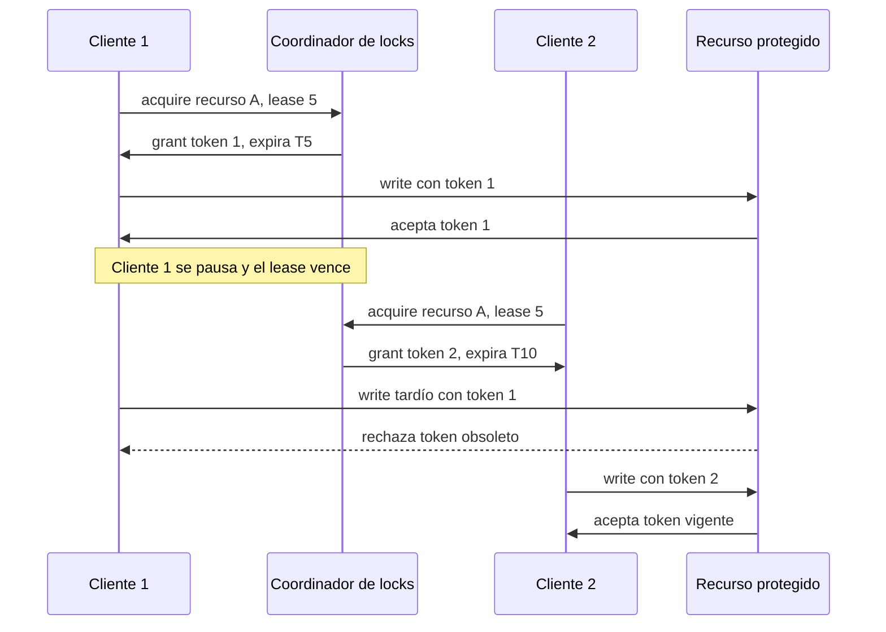

# 05. Locks distribuidos

> **Estado:** benchmarked.
>
> El capítulo cuenta con especificación inicial, modelo Rust mínimo y tests de
> invariantes, ejemplos progresivos, ejercicios, soluciones ejecutables y
> diagrama Mermaid. También cuenta con benchmark educativo manual. Todavía no
> tiene revisión humana y no está marcado como `published`.

## Concepto

Un lock distribuido coordina acceso exclusivo a un recurso cuando los clientes y
el recurso pueden vivir en nodos distintos.

La pregunta central no es "cómo bloqueo una variable", sino "bajo qué evidencia
aceptamos que este cliente puede operar sobre este recurso ahora".

## Problema

En una sola máquina, un mutex protege memoria compartida bajo reglas locales.
En un sistema distribuido, la propiedad de un recurso debe sobrevivir mensajes
tardíos, clientes pausados, expiraciones y observaciones parciales.

Locks distribuidos responden preguntas prácticas:

- quién puede operar un recurso compartido ahora;
- cuánto dura esa autorización;
- qué ocurre si el propietario deja de responder;
- cómo impedir que un propietario viejo escriba después de expirar;
- cómo explicar por qué una adquisición, renovación o liberación fue aceptada o
  rechazada.

## Diagrama



## Modelo educativo esperado

El modelo de este curso debe representar locks por lease con fencing tokens:

- `ClientId`: identidad estable de cliente;
- `ResourceId`: identidad estable de recurso;
- `LogicalTime`: tiempo lógico controlado por el escenario;
- `LeaseDuration`: duración lógica del permiso;
- `FencingToken`: número monótono asociado a una propiedad;
- `LockGrant`: concesión observable;
- `DistributedLockManager`: coordinador con locks activos, tokens e historial;
- adquisición de lock;
- renovación por propietario;
- liberación por propietario;
- expiración explícita;
- validación de operaciones con fencing token.

El objetivo no es construir un servicio de coordinación real. El objetivo es
aislar la diferencia entre exclusión local y propiedad temporal distribuida.

## Implementación

El módulo `src/distributed_locks.rs` implementa un coordinador determinista de
locks por lease con tiempo lógico. Su API expone una secuencia pequeña:

- adquirir un lock;
- renovar un lock vigente;
- liberar un lock vigente;
- avanzar el tiempo lógico;
- consultar propietario activo;
- validar operaciones con fencing token;
- consultar historial.

Uso básico:

```rust
use rust_distributed_systems::distributed_locks::{
    ClientId, DistributedLockManager, LeaseDuration, LogicalTime, ResourceId,
};

let mut locks = DistributedLockManager::new(LogicalTime(0));

let grant = locks.acquire(
    ClientId(1),
    ResourceId("billing-job"),
    LeaseDuration(5),
)?;
locks.validate_operation(ResourceId("billing-job"), grant.token)?;

assert_eq!(locks.owner(ResourceId("billing-job")), Some((ClientId(1), grant.token)));
# Ok::<(), rust_distributed_systems::distributed_locks::DistributedLockError>(())
```

## Invariantes

El capítulo debe hacer visibles estas reglas:

- un recurso tiene como máximo un propietario activo;
- todo lock tiene expiración;
- cada adquisición exitosa produce un fencing token mayor;
- solo el propietario vigente puede renovar;
- solo el propietario vigente puede liberar;
- un lock vencido deja de bloquear nuevas adquisiciones;
- una operación con token viejo no debe modificar el recurso protegido;
- el historial explica adquisiciones, renovaciones, liberaciones, expiraciones
  y rechazos.

## Alternativas

### Mutex local

Un mutex local es correcto dentro de un proceso, pero no coordina clientes en
nodos distintos.

### Lock en base de datos

Una base de datos puede representar locks con filas, restricciones únicas o
transacciones. Es práctico, pero oculta parte del mecanismo que el curso necesita
estudiar.

### Coordinador por consenso

Un coordinador respaldado por consenso puede ofrecer una autoridad más robusta,
pero conviene estudiarlo después de entender qué significa poseer un lock.

### Lease con fencing token

Es el modelo elegido para este capítulo. El lease limita el tiempo de propiedad;
el fencing token permite que el recurso protegido rechace operaciones viejas.

## Costos

Los locks distribuidos tienen precio:

- cada adquisición depende de una autoridad compartida;
- leases cortos generan más renovaciones;
- leases largos prolongan propiedad obsoleta después de fallas;
- fencing tokens obligan al recurso protegido a validar escrituras;
- particiones fuerzan decisiones entre progreso y seguridad;
- un coordinador simple puede convertirse en punto de falla.

## Benchmark educativo

El benchmark del capítulo vive en `benches/distributed_locks_bench.rs` y se
ejecuta con:

```bash
cargo bench --bench distributed_locks_bench
```

La salida imprime una tabla con cuatro mediciones:

- adquisición de lock disponible;
- rechazo por recurso ocupado;
- expiración y readquisición;
- rechazo de fencing token obsoleto.

Este benchmark no intenta representar un servicio real de coordinación. Usa
`std::time::Instant`, `std::hint::black_box` y repeticiones simples para ligar
cada operación con una invariante del capítulo.

Reglas de lectura:

- ejecutar varias veces antes de comparar;
- observar tendencias, no números absolutos;
- recordar que no hay red real, disco ni relojes físicos;
- no confundir esta medición educativa con benchmarking estadístico formal.

## Ejemplos progresivos

### Básico

`examples/soluciones/distributed_locks_basic_acquire.rs` muestra la ruta mínima:
un cliente adquiere un lock disponible y recibe `FencingToken(1)`.

La lección es que la concesión no solo dice "sí". También declara propietario,
recurso, token y expiración.

### Intermedio

`examples/soluciones/distributed_locks_intermediate_expiration.rs` muestra que
un segundo cliente no puede adquirir un recurso ocupado hasta que el tiempo
lógico alcanza la expiración del lease vigente.

La lección es que el lock distribuido no debe depender de que el propietario se
porte bien. Si desaparece, la expiración define cuándo el recurso puede volver a
adquirirse.

### Avanzado

`examples/soluciones/distributed_locks_advanced_fencing_token.rs` muestra el
caso más peligroso: un cliente viejo intenta operar después de que otro cliente
ya obtuvo un token más reciente.

La lección es que el lease por sí solo no basta. El recurso protegido debe
rechazar tokens obsoletos para evitar escrituras tardías.

### Caso real

`examples/soluciones/distributed_locks_real_scheduler_job.rs` interpreta el
recurso como una tarea programada de cierre diario. Un worker adquiere, renueva,
libera y otro worker toma el relevo con un token mayor.

Este caso conecta el modelo con sistemas reales: schedulers distribuidos,
procesamiento de lotes, migraciones, generación de reportes y tareas que deben
ejecutarse una sola vez por ventana.

## Modos de falla

El capítulo debe cubrir, como mínimo:

- recurso ocupado;
- lease expirado;
- token obsoleto;
- renovación desde cliente incorrecto;
- liberación desde cliente incorrecto;
- solicitud duplicada;
- coordinador no disponible.

## Límites

Este capítulo no promete:

- reloj físico confiable;
- servicio de locks de producción;
- consenso completo;
- persistencia real;
- red real;
- recuperación automática de coordinador;
- tolerancia a fallas bizantinas;
- API de producción.

Primero se aprende propiedad temporal. Después se estudia cómo se combina con
relojes lógicos, consenso, transacciones y operación real.

## Ejercicios

### Nivel 1: adquisición

Crea un `DistributedLockManager` en `LogicalTime(0)`. Adquiere el recurso
`ResourceId("billing-job")` con `ClientId(1)` y `LeaseDuration(5)`. Verifica que
el propietario activo sea `ClientId(1)` y que el token sea `FencingToken(1)`.

Solución sugerida:
`examples/soluciones/distributed_locks_basic_acquire.rs`.

### Nivel 2: expiración

Haz que `ClientId(1)` adquiera `ResourceId("indexer")`. Intenta que
`ClientId(2)` lo adquiera antes de la expiración y verifica
`DistributedLockError::ResourceBusy`. Después avanza el tiempo lógico hasta la
expiración y confirma que `ClientId(2)` obtiene el recurso con token mayor.

Solución sugerida:
`examples/soluciones/distributed_locks_intermediate_expiration.rs`.

### Nivel 3: token obsoleto

Haz que `ClientId(1)` adquiera un recurso, deja expirar su lease y permite que
`ClientId(2)` lo adquiera. Después valida una operación con el token viejo y
verifica que el modelo devuelve `DistributedLockError::StaleFencingToken`.

Solución sugerida:
`examples/soluciones/distributed_locks_advanced_fencing_token.rs`.

### Nivel 4: scheduler distribuido

Modela una tarea programada como recurso. Un worker debe adquirir el lock,
renovarlo mientras trabaja, liberarlo al terminar y permitir que otro worker
tome el relevo con un token mayor.

Solución sugerida:
`examples/soluciones/distributed_locks_real_scheduler_job.rs`.

## Referencias internas

- `docs/00-glosario.md`
- `docs/00-convenciones-de-simulacion.md`
- `docs/01-consenso.md`
- `docs/02-raft.md`
- `docs/04-eleccion-de-lider.md`
- `diagrams/05-locks-distribuidos.mmd`
- `docs/superpowers/specs/2026-07-20-distributed-locks-specification.md`
- `docs/superpowers/specs/2026-07-20-distributed-locks-chapter-close.md`

## Siguiente paso

El siguiente paso natural es revisar Locks distribuidos con criterio humano
antes de decidir si se agregan correcciones o si el capítulo puede avanzar hacia
publicación.
