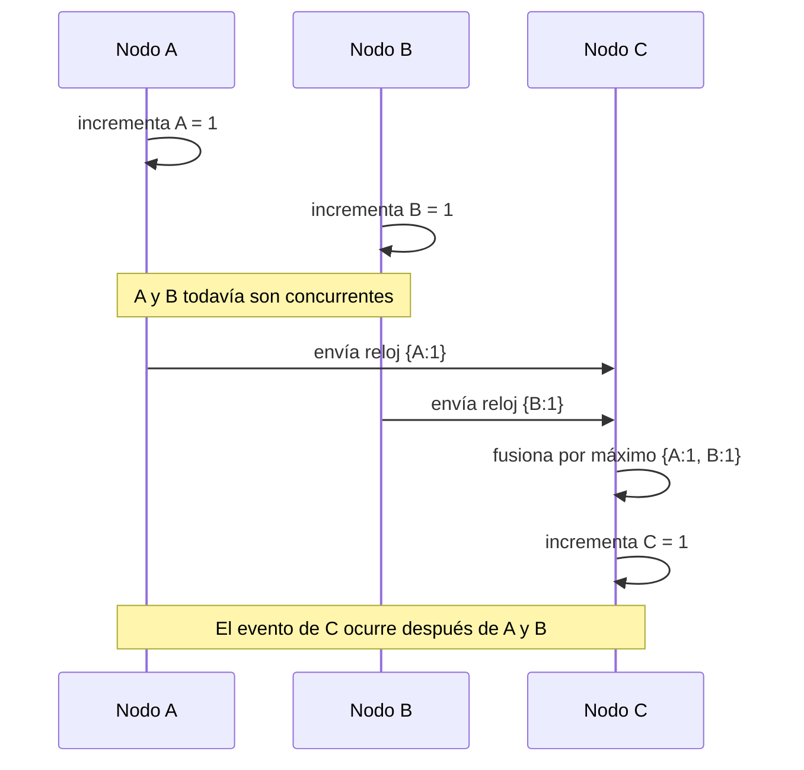

# 06. Vector clocks

> **Estado:** benchmarked.
>
> El capítulo cuenta con especificación inicial, modelo Rust mínimo y tests de
> invariantes, ejemplos progresivos, ejercicios, soluciones ejecutables,
> diagrama Mermaid y benchmark educativo manual. Todavía no tiene revisión
> humana y no está marcado como `published`.

## Concepto

Un vector clock representa evidencia causal entre eventos distribuidos mediante
un contador por nodo observado.

La pregunta central no es "qué hora era", sino "qué sabía este evento sobre los
eventos anteriores del sistema".

## Problema

En un sistema distribuido no todos los eventos tienen un orden demostrable. Dos
nodos pueden modificar datos al mismo tiempo sin observarse mutuamente. Si el
sistema ordena esas versiones solo por timestamp físico, puede borrar
concurrencia real.

Vector clocks responden preguntas prácticas:

- si una versión deriva causalmente de otra;
- si dos versiones son concurrentes;
- qué conocimiento debe fusionarse al recibir un mensaje;
- cuándo una actualización es vieja;
- cuándo una actualización necesita resolución de conflicto.

## Diagrama



## Modelo educativo esperado

El modelo de este curso debe representar causalidad parcial con relojes vector:

- `NodeId`: identidad estable de nodo;
- `Counter`: contador lógico por nodo;
- `CausalRelation`: relación entre dos relojes;
- `VectorClock`: mapa de nodo a contador;
- incremento local;
- fusión por máximo componente a componente;
- comparación causal;
- consulta de contador por nodo.

El objetivo no es simular una red ni construir un CRDT completo. El objetivo es
aprender a ver cuándo el sistema puede probar causalidad y cuándo solo puede
decir "estos eventos son concurrentes".

## Implementación

El módulo `src/vector_clock.rs` implementa un reloj vectorial determinista con
un mapa ordenado de nodos a contadores. Su API expone una secuencia pequeña:

- crear un reloj vacío;
- consultar el contador observado de un nodo;
- incrementar el contador local de un nodo;
- fusionar otro reloj por máximo componente a componente;
- construir un reloj fusionado sin mutar los originales;
- comparar dos relojes como `Equal`, `Before`, `After` o `Concurrent`.

La implementación trata los nodos ausentes como `Counter(0)`. Esta regla evita
casos especiales en la comparación: un reloj vacío está antes de uno que ya
observó eventos, y dos relojes con incrementos en nodos distintos son
concurrentes.

Uso básico:

```rust
use rust_distributed_systems::vector_clock::{
    CausalRelation, Counter, NodeId, VectorClock,
};

let mut mobile = VectorClock::new();
mobile.increment(NodeId(1));

let mut web = VectorClock::new();
web.increment(NodeId(2));

assert_eq!(mobile.counter(NodeId(1)), Counter(1));
assert_eq!(mobile.counter(NodeId(2)), Counter(0));
assert_eq!(mobile.compare(&web), CausalRelation::Concurrent);

let merged = mobile.merged(&web);
assert_eq!(mobile.compare(&merged), CausalRelation::Before);
assert_eq!(web.compare(&merged), CausalRelation::Before);
```

## Invariantes

El capítulo debe hacer visibles estas reglas:

- incrementar un nodo solo aumenta su propio contador;
- fusionar relojes conserva el máximo observado por cada nodo;
- después de fusionar no se pierde conocimiento;
- un reloj comparado consigo mismo es igual;
- `Before` significa inclusión causal estricta;
- `After` significa inclusión causal estricta en sentido contrario;
- `Concurrent` significa que ningún reloj contiene al otro;
- un nodo ausente cuenta como `Counter(0)` durante la comparación.

## Alternativas

### Timestamp físico

Un timestamp físico es cómodo para humanos, pero no prueba causalidad si los
relojes no están perfectamente sincronizados.

### Contador local

Un contador local ordena eventos dentro de un nodo, pero no entre nodos.

### Lamport clock

Lamport clocks son compactos y preservan una implicación útil: si A causó B,
entonces A tiene reloj menor que B. Pero no detectan concurrencia con precisión.

### Vector clock

Es el modelo elegido para este capítulo porque representa causalidad parcial de
forma explícita: antes, después, igual o concurrente.

## Costos

Vector clocks tienen precio:

- el tamaño del reloj crece con el número de nodos;
- cada mensaje debe cargar metadatos causales;
- comparar relojes exige revisar componentes;
- nodos dinámicos complican poda y compactación;
- detectar concurrencia no resuelve el conflicto automáticamente.

## Benchmark educativo

El benchmark del capítulo vive en `benches/vector_clock_bench.rs` y se ejecuta
con:

```bash
cargo bench --bench vector_clock_bench
```

La salida imprime una tabla con cuatro mediciones:

- incremento local;
- fusión por máximo;
- comparación causal;
- detección de concurrencia.

Este benchmark no intenta representar un sistema real de replicación. Usa
`std::time::Instant`, `std::hint::black_box` y repeticiones simples para ligar
cada operación con una invariante del capítulo.

Reglas de lectura:

- ejecutar varias veces antes de comparar;
- observar tendencias, no números absolutos;
- recordar que no hay red real, serialización ni almacenamiento;
- no confundir esta medición educativa con benchmarking estadístico formal.

## Ejemplos progresivos

### Básico

`examples/soluciones/vector_clock_basic_increment.rs` muestra la ruta mínima:
un nodo incrementa dos veces su propio contador y un nodo no observado se lee
como `Counter(0)`.

La lección es que un vector clock no empieza con una tabla global llena. Solo
registra lo que el evento ha observado.

### Intermedio

`examples/soluciones/vector_clock_intermediate_merge.rs` muestra un nodo que
recibe conocimiento de otro, fusiona por máximo y después incrementa su propio
contador.

La lección es que recibir un mensaje no solo transporta datos de aplicación:
también transporta evidencia causal.

### Avanzado

`examples/soluciones/vector_clock_advanced_concurrent_updates.rs` muestra dos
actualizaciones independientes que resultan `Concurrent`. Después crea un reloj
fusionado que queda causalmente después de ambas.

La lección es que detectar concurrencia no elige un ganador. Solo evita mentir:
el sistema sabe que necesita una política explícita de resolución.

### Caso real

`examples/soluciones/vector_clock_real_profile_conflict.rs` interpreta dos
ediciones de perfil hechas desde clientes distintos. Una modifica ciudad y la
otra nombre visible; como son concurrentes, la aplicación debe resolver el
conflicto y emitir una nueva versión cuyo reloj contiene ambas ramas.

Este caso conecta el modelo con sincronización offline, perfiles de usuario,
documentos colaborativos, carritos de compra y cualquier flujo donde varias
réplicas aceptan escritura antes de comunicarse.

## Modos de falla

El capítulo debe cubrir, como mínimo:

- actualización concurrente;
- mensaje atrasado;
- fusión incompleta;
- interpretación incorrecta de `Concurrent`;
- crecimiento excesivo del metadato;
- pérdida de componentes del reloj.

## Límites

Este capítulo no promete:

- orden total global;
- tiempo físico;
- resolución automática de conflictos;
- CRDT completo;
- persistencia real;
- red real;
- API de producción.

Primero se aprende causalidad parcial. Después se estudia cómo se usa para
replicación eventual, CRDTs, resolución de conflictos y diseños de sistemas.

## Ejercicios

### Nivel 1: incremento local

Crea un `VectorClock` vacío. Incrementa `NodeId(1)` dos veces y verifica que su
contador sea `Counter(2)`. Consulta `NodeId(2)` y confirma que devuelve
`Counter(0)`.

Solución sugerida:
`examples/soluciones/vector_clock_basic_increment.rs`.

### Nivel 2: fusión de conocimiento

Crea un reloj para `NodeId(1)` y otro para `NodeId(2)`. Haz que el segundo
fusione el primero, incremente su propio nodo y verifica que el primer reloj
esté `Before` respecto al segundo.

Solución sugerida:
`examples/soluciones/vector_clock_intermediate_merge.rs`.

### Nivel 3: concurrencia explícita

Modela dos actualizaciones que ocurren sin observarse: una en `NodeId(1)` y otra
en `NodeId(2)`. Verifica que la comparación sea `Concurrent`. Después fusiona
ambos relojes y confirma que el reloj fusionado está después de los dos.

Solución sugerida:
`examples/soluciones/vector_clock_advanced_concurrent_updates.rs`.

### Nivel 4: conflicto de perfil

Modela una versión base de perfil y dos ediciones concurrentes desde clientes
distintos. Una edición cambia ciudad y otra cambia nombre visible. Detecta la
concurrencia, resuelve el conflicto con una regla explícita y emite una versión
fusionada cuyo reloj contenga ambas ediciones.

Solución sugerida:
`examples/soluciones/vector_clock_real_profile_conflict.rs`.

## Referencias internas

- `docs/00-glosario.md`
- `docs/00-convenciones-de-simulacion.md`
- `docs/04-eleccion-de-lider.md`
- `docs/05-locks-distribuidos.md`
- `docs/superpowers/specs/2026-07-20-vector-clocks-specification.md`
- `docs/superpowers/specs/2026-07-20-vector-clocks-chapter-close.md`

## Siguiente paso

El siguiente paso natural es revisar Vector clocks con criterio humano antes de
decidir si se agregan correcciones o si el capítulo puede avanzar hacia
publicación.
