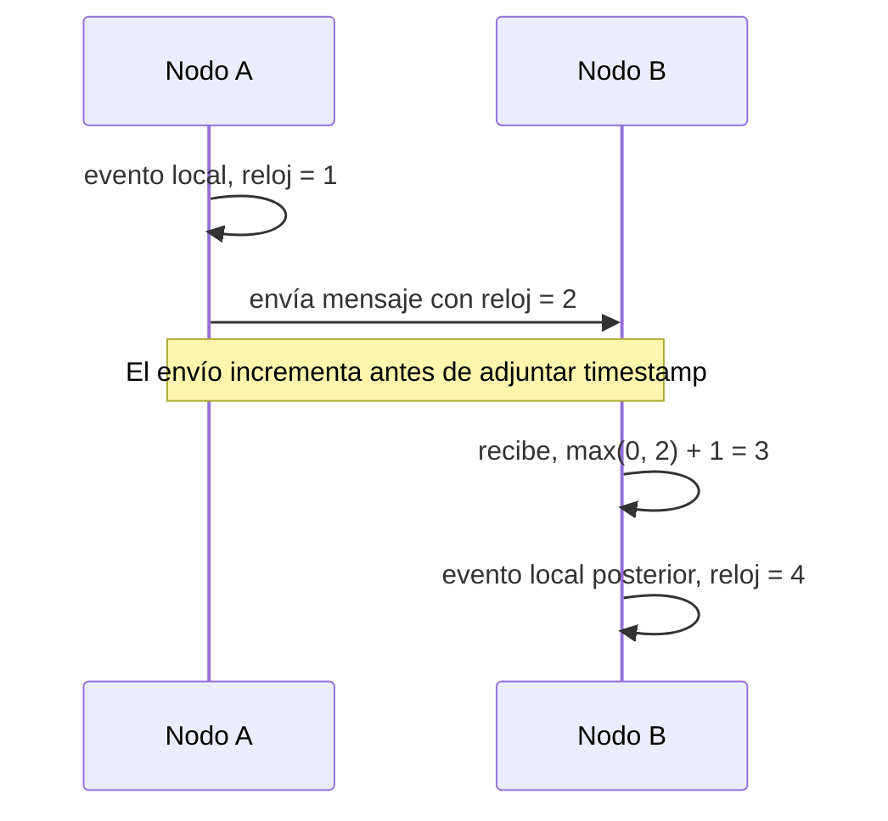

# 07. Lamport clocks

> **Estado:** tested.
>
> El capítulo cuenta con especificación inicial, modelo Rust mínimo y tests de
> invariantes, ejemplos progresivos y ejercicios. Todavía no tiene benchmark ni
> revisión humana.

## Concepto

Un Lamport clock representa tiempo lógico con un solo contador por nodo.

La pregunta central no es "qué hora era", sino "qué eventos deben observarse
como posteriores a otros dentro de una historia distribuida".

## Problema

En un sistema distribuido no existe un reloj físico perfecto compartido por
todos los nodos. Un mensaje puede enviarse desde una máquina con reloj atrasado
y recibirse en otra con reloj adelantado. Si el sistema confunde esos relojes
con causalidad, puede producir trazas imposibles de explicar.

Lamport clocks responden preguntas prácticas:

- cómo ordenar eventos sin un reloj global confiable;
- cómo asegurar que recibir un mensaje ocurre después de enviarlo;
- cómo construir trazas distribuidas deterministas;
- cuándo un contador lógico debe avanzar al observar otro nodo;
- por qué un orden escalar no prueba causalidad completa.

## Diagrama



## Modelo educativo esperado

El modelo de este curso debe representar relojes lógicos escalares:

- `NodeId`: identidad estable de nodo;
- `LamportTimestamp`: contador lógico escalar;
- `LamportClock`: reloj local de un nodo;
- `EventId`: desempate determinista opcional;
- evento local;
- envío de mensaje;
- recepción de mensaje con `max(local, remoto) + 1`;
- comparación de timestamps;
- orden total educativo cuando se combine timestamp con nodo.

El objetivo no es simular una red ni construir un sistema de trazas completo. El
objetivo es aprender la promesa exacta de Lamport: si A causó B, entonces el
timestamp de A es menor que el timestamp de B. El inverso no se promete.

## Implementación

El módulo `src/lamport_clock.rs` implementa un reloj Lamport determinista con un
contador escalar por nodo. Su API expone una secuencia pequeña:

- crear un reloj en cero para un nodo;
- consultar nodo y timestamp actual;
- registrar evento local;
- enviar mensaje con timestamp adjunto;
- recibir mensaje con `max(local, remoto) + 1`;
- ordenar eventos mediante `EventId`, compuesto por timestamp y nodo.

El desempate de `EventId` permite ordenar salidas educativas de forma estable.
Ese orden total es útil para trazas y pruebas, pero no agrega causalidad real.

Uso básico:

```rust
use rust_distributed_systems::lamport_clock::{
    EventId, LamportClock, LamportTimestamp, NodeId,
};

let mut sender = LamportClock::new(NodeId(1));
sender.local_event();

let message = sender.send();
let mut receiver = LamportClock::new(NodeId(2));
let received = receiver.receive(message);

assert_eq!(message.timestamp, LamportTimestamp(2));
assert_eq!(received, EventId::new(LamportTimestamp(3), NodeId(2)));
assert!(message.timestamp < received.timestamp);
```

## Invariantes

El capítulo debe hacer visibles estas reglas:

- el reloj local nunca retrocede;
- un evento local incrementa el contador;
- enviar un mensaje incrementa antes de adjuntar el timestamp;
- recibir un mensaje calcula `max(local, remoto) + 1`;
- la causalidad observada produce timestamps crecientes;
- un timestamp menor no prueba causalidad por sí mismo;
- el desempate para orden total debe ser explícito;
- el modelo no depende de tiempo físico.

## Alternativas

### Timestamp físico

Un timestamp físico es útil para humanos, pero no prueba causalidad si los
relojes de las máquinas no están perfectamente sincronizados.

### Contador local

Un contador local ordena eventos dentro de un nodo, pero no avanza al observar
mensajes de otros nodos.

### Vector clock

Un vector clock conserva más evidencia causal y detecta concurrencia, pero su
metadato crece con los nodos observados.

### Lamport clock

Es el modelo elegido para este capítulo porque es compacto, fácil de transportar
y suficiente para preservar orden lógico compatible con causalidad. Su límite es
igual de importante que su utilidad: no detecta concurrencia con precisión.

## Costos

Lamport clocks tienen precio:

- un contador escalar pierde información causal;
- eventos concurrentes pueden quedar ordenados por desempate;
- el orden total educativo no significa orden causal real;
- los mensajes deben cargar timestamps lógicos;
- reinicios sin persistencia pueden romper monotonía;
- depurar causalidad fina requiere volver a vector clocks u otro metadato.

## Ejemplos progresivos

### Básico

`examples/soluciones/lamport_clock_basic_local_event.rs` muestra la ruta mínima:
un nodo crea un reloj en cero y registra dos eventos locales.

La lección es que el tiempo lógico avanza por eventos observados, no por
segundos.

### Intermedio

`examples/soluciones/lamport_clock_intermediate_send_receive.rs` muestra un
nodo que envía un mensaje y otro que lo recibe con `max(local, remoto) + 1`.

La lección es que recibir un mensaje debe colocar al receptor después del envío
observado.

### Avanzado

`examples/soluciones/lamport_clock_advanced_trace_order.rs` construye una traza
con eventos de dos nodos y la ordena por `EventId`.

La lección es que el orden total estable sirve para narrar y probar escenarios,
pero el desempate por nodo no prueba causalidad.

### Caso real

`examples/soluciones/lamport_clock_real_audit_trace.rs` interpreta eventos de
checkout, pago y reservación como una auditoría distribuida. Cada servicio
produce o recibe eventos y la traza final se ordena por timestamp lógico.

Este caso conecta el modelo con bitácoras distribuidas, trazabilidad de
operaciones, debugging de incidentes y explicación de flujos multi-servicio.

## Modos de falla

El capítulo debe cubrir, como mínimo:

- eventos concurrentes con timestamps comparables;
- mensaje atrasado que obliga a avanzar por `max + 1`;
- interpretación incorrecta de orden escalar como causalidad probada;
- contador perdido tras reinicio;
- empate de timestamps sin desempate explícito;
- recepción de mensaje sin actualizar el reloj local.

## Límites

Este capítulo no promete:

- detectar concurrencia con precisión;
- representar todo el conocimiento causal;
- resolver conflictos;
- ordenar por tiempo físico;
- sincronización real de relojes;
- red real;
- persistencia real;
- API de producción.

Primero se aprende orden lógico compacto. Después se estudia cuándo ese orden
alcanza, cuándo necesita desempate y cuándo debe reemplazarse por evidencia
causal más rica.

## Ejercicios

### Nivel 1: evento local

Crea un `LamportClock` para `NodeId(1)`. Registra dos eventos locales y verifica
que produzcan `LamportTimestamp(1)` y `LamportTimestamp(2)`.

Solución sugerida:
`examples/soluciones/lamport_clock_basic_local_event.rs`.

### Nivel 2: envío y recepción

Haz que un nodo emisor registre un evento local y después envíe un mensaje.
Recibe ese mensaje en otro nodo y verifica que el evento de recepción tenga
timestamp `max(local, remoto) + 1`.

Solución sugerida:
`examples/soluciones/lamport_clock_intermediate_send_receive.rs`.

### Nivel 3: traza ordenada

Construye eventos concurrentes en dos nodos y un mensaje posterior entre ellos.
Ordena los eventos por `EventId` y explica cuáles relaciones son causales y
cuáles solo existen por desempate.

Solución sugerida:
`examples/soluciones/lamport_clock_advanced_trace_order.rs`.

### Nivel 4: auditoría distribuida

Modela un flujo de checkout, pago y reservación. Cada servicio debe tener su
propio `LamportClock`; los mensajes entre servicios deben transportar el
timestamp lógico. Ordena la auditoría final y explica por qué esa traza no
depende de relojes físicos.

Solución sugerida:
`examples/soluciones/lamport_clock_real_audit_trace.rs`.

## Referencias internas

- `docs/00-glosario.md`
- `docs/00-convenciones-de-simulacion.md`
- `docs/02-raft.md`
- `docs/03-paxos.md`
- `docs/06-vector-clocks.md`
- `docs/superpowers/specs/2026-07-20-lamport-clocks-specification.md`

## Siguiente paso

El siguiente paso natural es agregar el benchmark educativo del capítulo para
medir evento local, envío, recepción y ordenamiento de trazas.
