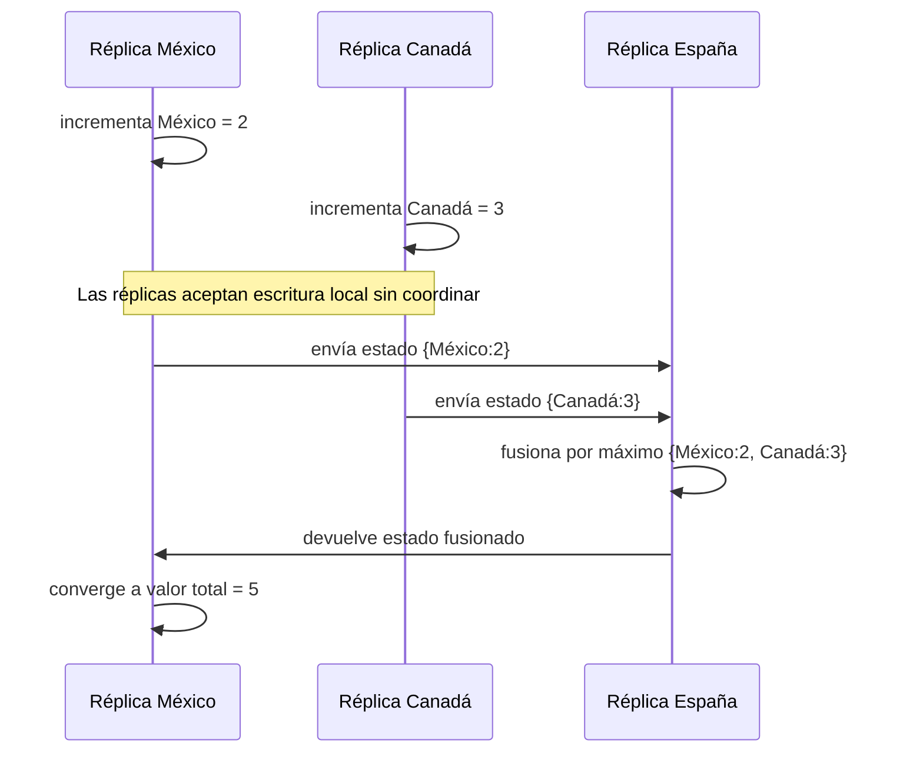

# 08. CRDTs

> **Estado:** benchmarked.
>
> El capítulo cuenta con especificación inicial, modelo Rust mínimo, tests de
> invariantes, ejemplos progresivos, ejercicios, soluciones ejecutables y
> diagrama Mermaid y benchmark educativo manual. Todavía no tiene revisión
> humana y no está marcado como `published`.

## Concepto

Un CRDT, Conflict-free Replicated Data Type, es una estructura de datos
replicada que puede modificarse en varias réplicas y converger sin coordinación
central en cada operación.

La pregunta central no es "quién ganó", sino "cómo diseñamos el estado para que
fusionarlo no pierda información legítima".

## Problema

En un sistema distribuido, pedir consenso para cada escritura puede ser correcto
pero caro. Durante una partición de red, también puede hacer que una parte del
sistema deje de aceptar cambios.

Pero muchas operaciones son naturalmente acumulativas: contar eventos,
registrar votos positivos, sumar confirmaciones, observar métricas por región o
contabilizar acciones offline. En esos casos, obligar a cada réplica a consultar
a un líder central puede ser más coordinación de la necesaria.

CRDTs responden preguntas prácticas:

- cómo aceptar cambios locales y sincronizar después;
- cómo tolerar mensajes duplicados o fuera de orden;
- cómo fusionar estados sin duplicar incrementos;
- cuándo la convergencia eventual es suficiente;
- qué reglas de negocio todavía necesitan coordinación fuerte.

## Diagrama



## Modelo educativo esperado

El modelo de este curso empieza con un G-Counter state-based:

- `ReplicaId`: identidad estable de réplica;
- `Count`: contador no negativo por réplica;
- `StateRelation`: relación parcial entre estados;
- `GCounter`: mapa de réplica a conteo;
- incremento local;
- incremento local por cantidad;
- consulta de conteo por réplica;
- valor total como suma de componentes;
- fusión por máximo componente a componente;
- comparación parcial entre estados.

El objetivo no es cubrir toda la familia CRDT de una vez. El objetivo es
aprender la primera idea estable: si el estado solo crece y el merge conserva el
máximo observado por componente, las réplicas pueden converger aunque se
sincronicen tarde.

## Implementación

El módulo `src/crdt.rs` implementa un G-Counter determinista con un mapa ordenado
de réplicas a conteos. Su API expone una secuencia pequeña:

- crear un contador vacío;
- consultar el conteo observado de una réplica;
- incrementar una réplica en uno;
- incrementar una réplica por una cantidad no negativa;
- calcular el valor total;
- fusionar otro estado por máximo componente a componente;
- construir un contador fusionado sin mutar los originales;
- comparar dos estados como `Equal`, `Before`, `After` o `Concurrent`.

La implementación trata las réplicas ausentes como `Count(0)`. Esta regla evita
casos especiales: un contador vacío está antes de uno que ya observó
incrementos, y dos contadores con incrementos en réplicas distintas son
concurrentes hasta que alguien los fusione.

Uso básico:

```rust
use rust_distributed_systems::crdt::{Count, GCounter, ReplicaId, StateRelation};

let mut mobile = GCounter::new();
mobile.increment(ReplicaId(1));
mobile.increment(ReplicaId(1));

let mut web = GCounter::new();
web.increment(ReplicaId(2));

assert_eq!(mobile.count(ReplicaId(1)), Count(2));
assert_eq!(mobile.count(ReplicaId(2)), Count(0));
assert_eq!(mobile.compare(&web), StateRelation::Concurrent);

let merged = mobile.merged(&web);
assert_eq!(merged.value(), Count(3));
assert_eq!(mobile.compare(&merged), StateRelation::Before);
assert_eq!(web.compare(&merged), StateRelation::Before);
```

## Invariantes

El capítulo debe hacer visibles estas reglas:

- una réplica solo incrementa su propio componente;
- un G-Counter no representa decrementos;
- fusionar estados conserva el máximo por réplica;
- fusionar el mismo estado dos veces no duplica incrementos;
- el orden de fusión no cambia el estado final;
- el agrupamiento de fusiones no cambia el estado final;
- dos réplicas que reciben los mismos estados convergen;
- después de fusionar no se pierde ningún incremento observado.

## Alternativas

### Coordinación fuerte

Consenso, transacciones distribuidas o un líder único pueden serializar
escrituras. Esa opción es necesaria para algunas reglas, pero reduce
disponibilidad cuando hay fallas o particiones.

### Last write wins

Elegir la versión con timestamp mayor es fácil de implementar, pero puede borrar
trabajo legítimo y depender de relojes físicos.

### Resolución manual

Guardar conflictos para que una persona o capa de aplicación decida puede ser
honesto, pero resulta excesivo para estructuras que tienen una fusión segura.

### CRDT

Es el modelo elegido para este capítulo porque enseña convergencia por diseño.
En vez de resolver conflictos después como casos especiales, se define una
operación de merge que conserva invariantes matemáticas.

## Costos

CRDTs tienen precio:

- cada réplica necesita identidad estable;
- el estado puede crecer con el número de réplicas;
- deletes y decrementos requieren modelos más complejos;
- convergencia eventual no garantiza lectura inmediata de la última escritura;
- reglas no monotónicas pueden requerir coordinación;
- compactar metadatos sin romper invariantes es difícil.

## Benchmark educativo

El benchmark del capítulo vive en `benches/crdt_bench.rs` y se ejecuta con:

```bash
cargo bench --bench crdt_bench
```

La salida imprime una tabla con cuatro mediciones:

- incremento local;
- fusión por máximo;
- comparación parcial;
- convergencia eventual.

Este benchmark no intenta representar un sistema real de replicación. Usa
`std::time::Instant`, `std::hint::black_box` y repeticiones simples para ligar
cada operación con una invariante del capítulo.

Reglas de lectura:

- ejecutar varias veces antes de comparar;
- observar tendencias, no números absolutos;
- recordar que no hay red real, serialización ni almacenamiento;
- no confundir esta medición educativa con benchmarking estadístico formal.

## Ejemplos progresivos

### Básico

`examples/soluciones/crdt_basic_increment.rs` muestra la ruta mínima: una
réplica incrementa su propio componente y una réplica no observada se lee como
`Count(0)`.

La lección es que un G-Counter no necesita conocer a todas las réplicas desde el
inicio. Solo registra componentes observados.

### Intermedio

`examples/soluciones/crdt_intermediate_merge.rs` muestra dos réplicas que
incrementan offline y después fusionan sus estados por máximo.

La lección es que fusionar por máximo conserva incrementos legítimos sin sumar
dos veces el mismo estado.

### Avanzado

`examples/soluciones/crdt_advanced_convergence.rs` entrega estados duplicados y
en distinto orden para demostrar idempotencia, conmutatividad y convergencia.

La lección es que el protocolo de sincronización puede ser imperfecto sin romper
el resultado, siempre que todas las réplicas terminen observando los mismos
estados.

### Caso real

`examples/soluciones/crdt_real_reservation_metrics.rs` modela confirmaciones de
reserva registradas en regiones distintas. Cada región incrementa localmente su
componente durante una partición y un agregador fusiona después los estados.

Este caso conecta el modelo con métricas distribuidas, contadores offline,
analítica eventual, eventos de producto y tableros que toleran retraso sin
perder incrementos.

## Modos de falla

El capítulo debe cubrir, como mínimo:

- incremento offline;
- mensaje duplicado;
- fusión fuera de orden;
- merge incorrecto por suma en vez de máximo;
- pérdida de identidad de réplica;
- prometer decrementos usando un G-Counter;
- confundir convergencia eventual con consistencia fuerte.

## Límites

Este capítulo no promete:

- decrementos;
- borrados;
- sets observados con tombstones;
- resolución de conflictos arbitrarios;
- compactación de metadatos;
- causalidad completa;
- red real;
- persistencia real;
- API de producción.

Primero se aprende convergencia monotónica. Después se estudian CRDTs más ricos,
sus costos de metadatos y los casos donde todavía conviene coordinar.

## Ejercicios

### Nivel 1: incremento local

Crea un `GCounter` vacío. Incrementa `ReplicaId(1)` dos veces y verifica que su
conteo sea `Count(2)`. Consulta `ReplicaId(2)` y confirma que devuelve
`Count(0)`.

Solución sugerida:
`examples/soluciones/crdt_basic_increment.rs`.

### Nivel 2: fusión offline

Crea dos contadores. En el primero incrementa `ReplicaId(1)` dos veces. En el
segundo incrementa `ReplicaId(2)` tres veces. Fusiona ambos y verifica que el
valor total sea `Count(5)`.

Solución sugerida:
`examples/soluciones/crdt_intermediate_merge.rs`.

### Nivel 3: convergencia con entregas imperfectas

Modela tres estados: dos réplicas con incrementos locales y un agregador.
Entrega los estados en orden distinto y repite una entrega. Verifica que el
estado final no duplique incrementos y que las réplicas converjan.

Solución sugerida:
`examples/soluciones/crdt_advanced_convergence.rs`.

### Nivel 4: métricas de reservas

Modela confirmaciones de reserva en regiones distintas. Cada región debe
incrementar localmente durante una partición. Después, un proceso de
sincronización debe fusionar los estados y producir el total global sin usar
relojes físicos ni elegir un ganador.

Solución sugerida:
`examples/soluciones/crdt_real_reservation_metrics.rs`.

## Referencias internas

- `docs/00-glosario.md`
- `docs/00-convenciones-de-simulacion.md`
- `docs/05-locks-distribuidos.md`
- `docs/06-vector-clocks.md`
- `docs/07-lamport-clocks.md`
- `docs/superpowers/specs/2026-07-20-crdts-specification.md`
- `docs/superpowers/specs/2026-07-20-crdts-chapter-close.md`

## Siguiente paso

El siguiente paso natural es revisar CRDTs con criterio humano antes de decidir
si se agregan correcciones o si el capítulo puede avanzar hacia publicación.
