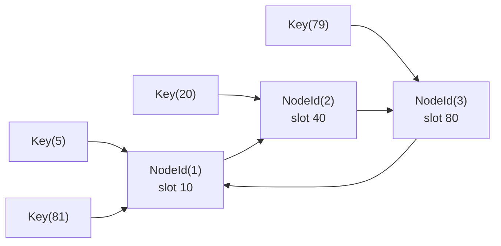

# 10. Consistent hashing

> **Estado:** tested.
>
> El capítulo cuenta con especificación inicial, modelo Rust mínimo, tests de
> invariantes, ejemplos progresivos, ejercicios, soluciones ejecutables y
> diagrama Mermaid. Todavía no tiene benchmark, revisión humana ni está marcado
> como `published`.

## Concepto

Consistent hashing distribuye claves entre nodos intentando que un cambio de
membresía mueva solo una parte acotada del espacio de claves.

La pregunta central no es "qué función hash usamos", sino "cuántas claves deben
cambiar de dueño cuando agregamos o quitamos un nodo".

## Problema

En un sistema distribuido, agregar capacidad no debería obligar a mover todo el
estado. Un reparto ingenuo con `hash(clave) % N` parece natural, pero cambiar
`N` cambia el resultado para muchas claves.

Ese movimiento masivo duele en sistemas reales:

- cachés pierden demasiadas entradas calientes;
- particiones de almacenamiento deben migrar datos de más;
- clientes observan rutas distintas durante cambios de membresía;
- balancear carga se vuelve una operación disruptiva;
- quitar un nodo puede producir trabajo manual para reubicar claves.

Consistent hashing responde preguntas prácticas:

- qué nodo debe atender una clave;
- qué claves cambian de dueño al agregar capacidad;
- qué claves cambian de dueño al retirar un nodo;
- por qué módulo por `N` es frágil ante cambios;
- cómo separar la idea del anillo de problemas posteriores como replicación,
  gossip de membresía o migración real de datos.

## Diagrama



## Modelo educativo esperado

El modelo de este curso empieza con un anillo determinista:

- `NodeId`: identidad estable de nodo;
- `Key`: clave lógica de usuario;
- `HashSlot`: posición dentro del anillo;
- `RingNode`: nodo ubicado en una posición;
- `ConsistentHashRing`: colección ordenada de nodos;
- `KeyMovement`: cambio observable de dueño para una clave;
- inserción y retiro de nodos;
- asignación por primer sucesor;
- wrap-around al inicio del anillo;
- comparación de movimientos entre dos anillos.

El objetivo no es construir un particionador de producción. El objetivo es
aprender la primera propiedad importante: cuando cambia la membresía, no todas
las claves deberían cambiar de dueño.

## Implementación

El módulo `src/consistent_hashing.rs` implementa un anillo con mapas ordenados
de la biblioteca estándar. Su API expone una secuencia pequeña:

- crear un anillo vacío;
- construir un anillo desde nodos iniciales;
- insertar o reposicionar un nodo;
- retirar un nodo por identidad;
- consultar el dueño de una clave;
- listar nodos ordenados por posición;
- comparar movimientos de claves entre dos anillos.

El modelo usa posiciones explícitas (`HashSlot`) para que los ejemplos sean
predecibles. En un sistema real, la posición vendría de una función hash estable
aplicada a nodos y claves. Aquí el punto pedagógico es observar el anillo y el
movimiento, no esconderlo detrás de una función opaca.

Uso básico:

```rust
use rust_distributed_systems::consistent_hashing::{
    ConsistentHashRing, HashSlot, Key, NodeId, RingNode,
};

let ring = ConsistentHashRing::from_nodes([
    RingNode::new(NodeId(1), HashSlot(10)),
    RingNode::new(NodeId(2), HashSlot(40)),
    RingNode::new(NodeId(3), HashSlot(80)),
]);

assert_eq!(ring.owner(Key(5)), Some(NodeId(1)));
assert_eq!(ring.owner(Key(39)), Some(NodeId(2)));
assert_eq!(ring.owner(Key(81)), Some(NodeId(1)));
```

## Invariantes

El capítulo debe hacer visibles estas reglas:

- un anillo vacío no tiene dueño para ninguna clave;
- una misma clave debe producir la misma posición dentro del modelo;
- los nodos se ordenan de forma determinista;
- una clave pertenece al primer nodo sucesor en el anillo;
- si no existe sucesor hacia adelante, la búsqueda vuelve al inicio;
- dos anillos con los mismos nodos asignan las mismas claves;
- agregar un nodo solo mueve las claves del rango que ese nodo toma;
- quitar un nodo solo mueve las claves que pertenecían al nodo retirado;
- reposicionar un `NodeId` mantiene identidad única.

## Alternativas

### Módulo por cantidad de nodos

`hash(clave) % N` es simple y barato. El problema es que `N` forma parte de la
decisión: al cambiar `N`, muchas claves cambian de resultado aunque sus datos no
hayan cambiado.

### Tabla central de asignación

Una tabla explícita de clave a nodo ofrece control fino, pero exige almacenar,
replicar y actualizar mucho metadato. También puede convertirse en otro sistema
distribuido que necesita coordinación.

### Rango fijo por nodo

Dividir el espacio en rangos manuales puede funcionar con operación cuidadosa,
pero cada rebalanceo exige intervención explícita y reglas de migración.

### Consistent hashing

Es el modelo elegido porque enseña movimiento localizado. Agregar un nodo toma
un rango; quitar un nodo entrega su rango al sucesor. Esa idea pequeña aparece
en cachés, almacenamiento particionado, ruteo de claves y sistemas con
membresía cambiante.

## Costos

Consistent hashing tiene precio:

- el balance depende de la distribución de posiciones;
- pocos nodos pueden producir rangos desiguales;
- réplicas virtuales mejoran balance, pero agregan metadatos;
- todos los participantes deben compartir una vista compatible de membresía;
- el movimiento baja, pero no desaparece;
- claves calientes siguen siendo calientes aunque el anillo sea correcto;
- migrar datos reales exige protocolos fuera del anillo.

## Ejemplos progresivos

### Básico

`examples/soluciones/consistent_hashing_basic_owner.rs` muestra tres nodos y
varias claves. La lección es la asignación por sucesor: la clave pertenece al
primer nodo que aparece al avanzar en el anillo.

### Intermedio

`examples/soluciones/consistent_hashing_intermediate_add_node.rs` agrega un nodo
entre dos posiciones existentes y observa qué claves cambian de dueño.

La lección es que agregar capacidad no debe remapear todo: solo se mueve el
rango que el nuevo nodo toma.

### Avanzado

`examples/soluciones/consistent_hashing_advanced_remove_node.rs` retira un nodo
y compara movimientos. También conserva claves fuera del rango retirado.

La lección es que quitar un nodo también debe tener costo localizado: sus claves
pasan al sucesor, no a todo el anillo.

### Caso real

`examples/soluciones/consistent_hashing_real_cache_shards.rs` modela shards de
caché para perfiles de usuario. Agregar un shard nuevo mueve solo algunas
claves simuladas.

Este caso conecta el modelo con cachés distribuidas, ruteo de solicitudes,
particiones de almacenamiento y migraciones graduales.

## Modos de falla

El capítulo debe cubrir, como mínimo:

- anillo vacío;
- función hash o posiciones mal distribuidas;
- nodos con rangos demasiado grandes;
- clientes con vistas distintas de membresía;
- retiro de nodo sin migración de datos;
- confundir movimiento acotado con movimiento cero;
- usar módulo por `N` y remapear casi todo al cambiar capacidad.

## Límites

Este capítulo no promete:

- balance perfecto;
- pesos por nodo;
- réplicas virtuales;
- replicación de datos;
- detección real de nodos caídos;
- consenso de membresía;
- migración real de datos;
- protección automática contra claves calientes;
- hash criptográfico.

Primero se aprende la forma del anillo. Después se agregan réplicas virtuales,
gossip de membresía, migración y estrategias de rebalanceo.

## Ejercicios

### Nivel 1: dueño por sucesor

Crea un anillo con nodos en `HashSlot(10)`, `HashSlot(40)` y `HashSlot(80)`.
Verifica que `Key(39)` pertenezca al nodo en `HashSlot(40)` y que `Key(81)`
haga wrap-around al nodo en `HashSlot(10)`.

Solución sugerida:
`examples/soluciones/consistent_hashing_basic_owner.rs`.

### Nivel 2: agregar capacidad

Crea un anillo con nodos en `HashSlot(10)` y `HashSlot(80)`. Agrega un nodo en
`HashSlot(40)` y calcula los movimientos para varias claves. Verifica que solo
se muevan las claves del rango tomado por el nuevo nodo.

Solución sugerida:
`examples/soluciones/consistent_hashing_intermediate_add_node.rs`.

### Nivel 3: retirar un nodo

Crea un anillo con tres nodos. Retira el nodo intermedio y verifica que solo sus
claves cambien de dueño hacia el sucesor.

Solución sugerida:
`examples/soluciones/consistent_hashing_advanced_remove_node.rs`.

### Nivel 4: shards de caché

Modela tres shards de caché y un conjunto de claves de usuario. Agrega un shard
nuevo y enumera qué perfiles cambiarían de destino. Explica qué datos habría que
migrar antes de enrutar tráfico real.

Solución sugerida:
`examples/soluciones/consistent_hashing_real_cache_shards.rs`.

## Referencias internas

- `docs/00-glosario.md`
- `docs/00-convenciones-de-simulacion.md`
- `docs/09-teorema-cap.md`
- `docs/11-protocolo-gossip.md` cuando exista
- `docs/superpowers/specs/2026-07-20-consistent-hashing-specification.md`

## Siguiente paso

El siguiente paso natural es agregar el benchmark educativo de Consistent
hashing y cerrar el estado del capítulo como `benchmarked`, sin marcarlo como
`reviewed` ni `published` hasta que exista revisión humana.
