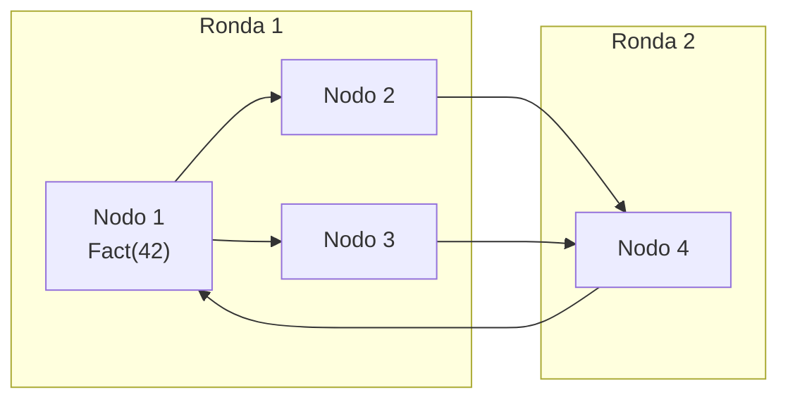

# 11. Protocolo gossip

> **Estado:** tested.
>
> El capítulo cuenta con especificación inicial, modelo Rust mínimo y tests de
> invariantes. También cuenta con capítulo extendido, ejemplos progresivos,
> ejercicios, soluciones ejecutables y diagrama Mermaid. Todavía no tiene
> benchmark educativo, revisión humana ni está marcado como `published`.

## Concepto

Un protocolo gossip propaga información de forma epidémica: cada nodo comparte
lo que sabe con algunos pares y, ronda tras ronda, el conocimiento se extiende
por el sistema.

La pregunta central no es "a quién le mandamos todo", sino "cómo hacemos que el
conocimiento se propague aunque cada nodo hable solo con una parte del cluster".

## Problema

En sistemas distribuidos, muchas señales no necesitan consenso inmediato:
membresía, métricas, hints, versiones, estado de salud y datos eventualmente
consistentes. Pedir coordinación fuerte para cada señal puede ser más caro que
el valor de la señal.

Gossip permite que los nodos propaguen conocimiento parcial de manera repetida,
idempotente y tolerante a fallas temporales.

El punto fino es aceptar que gossip no entrega una confirmación global inmediata.
En lugar de preguntar "¿todos lo saben ya?", el sistema pregunta "¿la
información se sigue propagando de forma segura hasta que haya suficiente
conectividad?".

## Diagrama



El diagrama no representa una red fija. Representa contactos por ronda: cada
nodo disponible elige algunos pares, comparte su conocimiento y deja que la
propagación avance sin coordinador central.

## Modelo educativo esperado

El modelo de este curso empieza con una simulación determinista:

- `GossipNodeId`: identidad estable de nodo;
- `GossipFact`: hecho propagable;
- `Fanout`: límite de pares contactados por emisor en una ronda;
- `GossipCluster`: conjunto de nodos y conocimiento observado;
- `GossipContact`: mensaje observable entre dos nodos;
- `GossipRoundReport`: resumen de mensajes y hechos entregados;
- disponibilidad por nodo;
- rondas push con snapshot inicial;
- convergencia eventual cuando hay conectividad suficiente.

El objetivo no es implementar SWIM, HyParView, anti-entropy completo ni
selección probabilística real. El objetivo es ver las invariantes que hacen que
gossip sea útil: monotonicidad, idempotencia, fanout acotado, tolerancia a
duplicados y avance por rondas.

## Implementación

El módulo `src/gossip.rs` implementa un cluster determinista con `GossipNodeId`,
`GossipFact`, `Fanout`, `GossipCluster`, `GossipContact` y
`GossipRoundReport`. Las rondas usan un snapshot del conocimiento inicial para
que los hechos recibidos se retransmitan hasta la siguiente ronda.

Uso básico:

```rust
use rust_distributed_systems::gossip::{
    Fanout, GossipCluster, GossipFact, GossipNodeId,
};

let mut cluster = GossipCluster::from_nodes([
    GossipNodeId(1),
    GossipNodeId(2),
    GossipNodeId(3),
]);
let fact = GossipFact(42);

cluster.insert_fact(GossipNodeId(1), fact);
let report = cluster.run_round(Fanout(2));

assert_eq!(report.messages_sent, 2);
assert_eq!(cluster.coverage(fact), 3);
```

La API evita aleatoriedad para que cada ejemplo sea repetible. Eso permite
probar la forma del protocolo sin esconder los resultados detrás de decisiones
azarosas.

## Invariantes

El modelo educativo debe hacer visibles estas reglas:

- recibir gossip solo agrega conocimiento;
- recibir el mismo hecho varias veces no duplica estado;
- un nodo no disponible no envía ni recibe durante una ronda;
- cada nodo contacta como máximo `Fanout` pares por ronda;
- la propagación no depende de un coordinador global;
- si hay conectividad suficiente durante suficientes rondas, los nodos
  disponibles convergen;
- el modelo puede reportar cuántos nodos conocen un hecho.

## Alternativas

### Broadcast completo

Mandar cada actualización a todos los nodos reduce la incertidumbre de una
ronda, pero escala mal. En clusters grandes, cada señal pequeña puede volverse
un costo de red grande.

### Coordinador central

Un coordinador simplifica la lectura mental del sistema, pero introduce otro
punto de falla y otra fuente de presión. Además, no todas las señales merecen
consenso o coordinación fuerte.

### Polling periódico

Consultar a una fuente central cada cierto tiempo es fácil de instrumentar,
pero retrasa la propagación y concentra tráfico. También puede ocultar fallas:
si la fuente central se degrada, todos dependen de ella.

### Gossip

Gossip acepta propagación parcial y repetida. No promete orden total ni
confirmación inmediata, pero ofrece difusión gradual, tolerancia a duplicados y
menor dependencia de un punto único.

## Costos

Gossip tiene precio:

- la convergencia toma rondas;
- una mala selección de pares puede retrasar la difusión;
- el fanout bajo ahorra mensajes, pero propaga más lento;
- el fanout alto propaga más rápido, pero aumenta tráfico;
- una partición de red puede aislar conocimiento;
- los hechos obsoletos necesitan versiones, expiración o reconciliación;
- observar que un hecho llegó no equivale a consenso;
- depurar sistemas epidémicos exige buenas métricas.

## Ejemplos progresivos

### Básico

`examples/soluciones/gossip_basic_single_round.rs` crea tres nodos, inserta un
hecho en uno de ellos y ejecuta una ronda con `Fanout(2)`.

La lección es directa: si el emisor conoce un hecho y contacta a todos sus pares
disponibles, el conocimiento se propaga sin coordinador central.

### Intermedio

`examples/soluciones/gossip_intermediate_unavailable_node.rs` marca un nodo como
no disponible antes de la ronda.

La lección es que gossip no fuerza entrega a nodos caídos. El conocimiento no se
pierde, pero el nodo desconectado tendrá que ponerse al día después.

### Avanzado

`examples/soluciones/gossip_advanced_eventual_convergence.rs` usa `Fanout(1)`
para mostrar convergencia en varias rondas.

La lección es que fanout bajo puede ser suficiente, pero el avance se observa en
el tiempo. Gossip se entiende mejor como proceso repetido que como llamada
única.

### Caso real

`examples/soluciones/gossip_real_membership_hint.rs` modela hints de membresía:
un nodo aprende que hay una versión nueva de vista del cluster y la comparte con
sus pares.

La lección es que gossip suele transportar señales pequeñas: versiones,
heartbeat lógico, hints de membresía, métricas o metadatos de reconciliación.
Las decisiones fuertes, como aceptar una configuración definitiva, pertenecen a
capítulos de consenso.

## Modos de falla

El capítulo debe cubrir, como mínimo:

- fanout cero;
- cluster vacío;
- nodos temporalmente no disponibles;
- hechos duplicados;
- partición sostenida;
- conocimiento que tarda varias rondas;
- confundir convergencia eventual con consistencia fuerte;
- propagar hechos sin versión ni forma de caducar información obsoleta;
- usar gossip para decisiones que requieren quorum.

## Límites

Este capítulo no promete:

- red real;
- selección aleatoria criptográficamente segura;
- detector de fallas;
- protocolo SWIM completo;
- anti-entropy basado en árboles de Merkle;
- orden total;
- consenso;
- membresía final;
- expiración automática de hechos;
- garantías probabilísticas formales.

Primero se aprende la forma epidémica de la propagación. Después se puede
agregar selección aleatoria, sospecha de fallas, versiones, reconciliación y
mecanismos de membresía.

## Ejercicios

### Nivel 1: una ronda visible

Crea un cluster con tres nodos. Inserta `GossipFact(42)` en el nodo 1 y ejecuta
una ronda con `Fanout(2)`. Verifica que los tres nodos conozcan el hecho.

Solución sugerida: `examples/soluciones/gossip_basic_single_round.rs`.

### Nivel 2: nodo no disponible

Crea un cluster con tres nodos. Inserta un hecho en el nodo 1, marca el nodo 3
como no disponible y ejecuta una ronda con `Fanout(2)`. Verifica que el nodo 3
no reciba el hecho durante esa ronda.

Solución sugerida:
`examples/soluciones/gossip_intermediate_unavailable_node.rs`.

### Nivel 3: convergencia eventual

Crea un cluster con cuatro nodos y `Fanout(1)`. Inserta un hecho en el nodo 1 y
ejecuta rondas hasta que todos los nodos disponibles conozcan el mismo conjunto
de hechos.

Solución sugerida:
`examples/soluciones/gossip_advanced_eventual_convergence.rs`.

### Nivel 4: hint de membresía

Modela un hecho como versión de membresía. Inserta una versión nueva en un nodo,
propágala por gossip y explica por qué esa propagación no sustituye al consenso
de configuración.

Solución sugerida: `examples/soluciones/gossip_real_membership_hint.rs`.

## Referencias internas

- `docs/00-glosario.md`
- `docs/00-convenciones-de-simulacion.md`
- `docs/08-crdts.md`
- `docs/09-teorema-cap.md`
- `docs/10-consistent-hashing.md`
- `docs/superpowers/specs/2026-07-20-gossip-protocol-specification.md`

## Siguiente paso

El siguiente paso natural es cerrar el capítulo con un benchmark educativo que
compare propagación de una ronda, convergencia eventual, nodos no disponibles y
recuperación posterior.
