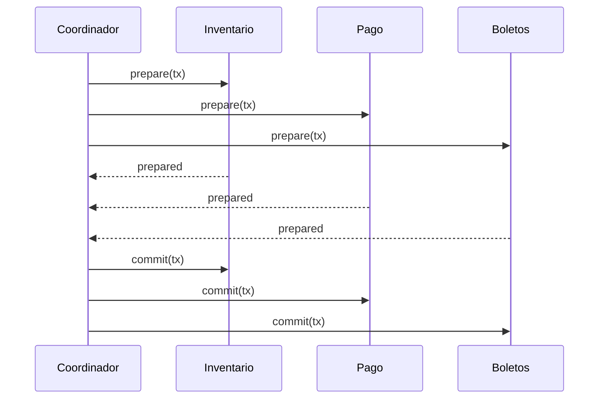

# 12. Transacciones distribuidas

> **Estado:** tested.
>
> El capítulo cuenta con especificación inicial, modelo Rust mínimo y tests de
> invariantes. También cuenta con capítulo extendido, ejemplos progresivos,
> ejercicios, soluciones ejecutables y diagrama Mermaid. Todavía no tiene
> benchmark educativo, revisión humana ni está marcado como `published`.

## Concepto

Una transacción distribuida coordina una decisión que afecta a más de un
participante. El problema no es enviar dos solicitudes. El problema es preservar
invariantes cuando una parte acepta, otra falla, la red se retrasa y los
mensajes pueden repetirse.

La pregunta central no es "cómo garantizamos exactly-once". La pregunta central
es qué significa aplicar un efecto una sola vez cuando el sistema necesita
reintentar, deduplicar, compensar y registrar decisiones bajo incertidumbre.

## Problema

Operaciones como reservas, pagos, facturación, inventario y emisión de boletos
cruzan varias fronteras. Si todo sucede dentro de una sola base local, una
transacción local puede bastar. Cuando la operación cruza servicios, bases,
colas o regiones, el sistema debe elegir entre coordinación fuerte,
compensación, idempotencia y aceptación explícita de estados intermedios.

Una operación distribuida debe responder preguntas incómodas:

- qué pasa si un participante preparó y otro rechazó;
- qué pasa si el coordinador decide, pero un mensaje se repite;
- qué pasa si una saga cobró, pero no pudo emitir el boleto;
- qué significa compensar cuando el mundo real ya cambió;
- por qué exactly-once requiere identidad, deduplicación y registros
  observables.

## Diagrama



El diagrama muestra el caso feliz de 2PC. El capítulo existe porque el caso
feliz no basta: un rechazo, una caída o una partición cambia el costo de la
decisión.

## Modelo educativo esperado

El modelo de este curso compara dos familias de decisión:

- `TwoPhaseCommit`: coordinación fuerte educativa;
- `Saga`: pasos locales con compensación explícita;
- `TransactionId`: identidad estable para reintentos;
- `ParticipantId`: identidad de participante;
- `ParticipantVote`: preparación o rechazo;
- `TransactionDecision`: commit o abort;
- `TransactionEvent`: historial observable de 2PC;
- `SagaStep`: paso determinista;
- `SagaOutcome`: resultado aplicado o compensado;
- `SagaEvent`: historial observable de pasos y compensaciones.

El objetivo no es construir un coordinador transaccional de producción. El
objetivo es separar tres ideas que suelen confundirse: atomicidad coordinada,
compensación de negocio e idempotencia práctica.

## Implementación

El módulo `src/distributed_transactions.rs` implementa un coordinador 2PC
determinista y un ejecutor de sagas educativas.

Uso básico de 2PC:

```rust
use rust_distributed_systems::distributed_transactions::{
    ParticipantId, ParticipantVote, TransactionDecision, TransactionId,
    TwoPhaseCommit,
};

let mut coordinator =
    TwoPhaseCommit::from_participants([ParticipantId(1), ParticipantId(2)]);

let decision = coordinator
    .decide(
        TransactionId(1),
        [
            (ParticipantId(1), ParticipantVote::Prepared),
            (ParticipantId(2), ParticipantVote::Prepared),
        ],
    )
    .unwrap();

assert_eq!(decision, TransactionDecision::Committed);
```

Uso básico de saga:

```rust
use rust_distributed_systems::distributed_transactions::{
    Saga, SagaOutcome, SagaStep, SagaStepId, TransactionId,
};

let mut saga = Saga::from_steps([
    SagaStep::new(SagaStepId("reservar"), true),
    SagaStep::new(SagaStepId("cobrar"), false),
]);

assert!(matches!(
    saga.run(TransactionId(2)),
    SagaOutcome::Compensated { .. }
));
```

## Invariantes

El modelo educativo debe hacer visibles estas reglas:

- una transacción tiene identidad estable;
- 2PC confirma solo si todos los participantes preparan;
- si un participante rechaza preparar, la transacción aborta;
- un participante preparado no inventa commit sin decisión;
- reintentar la misma transacción no duplica efectos;
- una saga compensa pasos aplicados en orden inverso;
- una compensación queda registrada como acción observable;
- exactly-once práctico se construye con idempotencia y deduplicación.

## Alternativas

### Transacción local

Una transacción local dentro de un motor de base de datos es la opción más clara
cuando todos los datos viven bajo la misma autoridad. Su límite aparece cuando
la operación cruza procesos, servicios, motores o regiones.

### Two-phase commit

2PC ofrece una decisión atómica coordinada: primero pregunta si todos pueden
preparar y después decide commit o abort. Enseña una verdad importante: mayor
atomicidad puede introducir bloqueo y operación compleja.

### Saga

Una saga divide el flujo en pasos confirmados localmente. Si algo falla, ejecuta
compensaciones. Enseña otra verdad: compensar no siempre equivale a deshacer.
Puede ser correcto para negocio, pero no es atomicidad fuerte.

### Idempotencia

La idempotencia permite reintentar sin duplicar efectos. Es esencial para
webhooks, colas, pagos y consumidores que pueden recibir el mismo mensaje más
de una vez.

### Exactly-once práctico

Exactly-once no debe entenderse como "la red entrega una sola vez". En sistemas
reales se aproxima con identificadores estables, deduplicación, commits
transaccionales disponibles, registros de procesamiento y diseño de extremo a
extremo.

## Costos

Transacciones distribuidas tienen precio:

- 2PC puede bloquear participantes preparados;
- un coordinador no replicado es un punto de fragilidad;
- una saga puede mostrar efectos intermedios;
- una compensación puede fallar;
- una compensación puede no ser equivalente a revertir;
- idempotencia exige guardar claves procesadas;
- deduplicación exige retención y limpieza;
- exactly-once práctico exige disciplina en todos los bordes;
- el estado incierto debe ser visible para operación humana.

## Ejemplos progresivos

### Básico

`examples/soluciones/distributed_transactions_basic_2pc_commit.rs` muestra un
2PC con dos participantes que preparan y terminan en commit.

La lección es que commit requiere unanimidad de preparación.

### Intermedio

`examples/soluciones/distributed_transactions_intermediate_2pc_abort.rs` muestra
un participante que rechaza preparar.

La lección es que un solo rechazo basta para abortar y que reintentar la misma
transacción devuelve la decisión ya tomada.

### Avanzado

`examples/soluciones/distributed_transactions_advanced_saga_compensation.rs`
muestra una saga que falla en el tercer paso y compensa los dos pasos previos en
orden inverso.

La lección es que la compensación es una acción explícita y observable.

### Caso real

`examples/soluciones/distributed_transactions_real_reservation_checkout.rs`
modela un checkout de reserva: inventario, pago y emisión de boleto.

La lección es que el diseño real suele combinar identidad estable,
idempotencia, decisiones observables y compensaciones de negocio.

## Modos de falla

El capítulo debe cubrir, como mínimo:

- voto faltante;
- participante desconocido;
- rechazo de preparación;
- reintento de una transacción ya decidida;
- saga con falla intermedia;
- compensación ejecutada en orden incorrecto;
- confundir compensación con rollback perfecto;
- prometer exactly-once sin deduplicación ni idempotencia.

## Límites

Este capítulo no promete:

- red real;
- persistencia durable;
- recovery después de reinicio;
- locks reales de base de datos;
- aislamiento serializable;
- consenso de coordinador;
- colas transaccionales reales;
- dinero real;
- exactly-once absoluto;
- seguridad ante participantes maliciosos.

Primero se aprende la forma de la decisión. Después se estudian logs durables,
recovery, colas, outbox, inbox, motores de base de datos y operación de
incidentes.

## Ejercicios

### Nivel 1: commit por unanimidad

Crea un coordinador 2PC con dos participantes. Ambos deben votar `Prepared`.
Verifica que la decisión final sea `Committed`.

Solución sugerida:
`examples/soluciones/distributed_transactions_basic_2pc_commit.rs`.

### Nivel 2: abort por rechazo

Crea un coordinador 2PC con tres participantes. Haz que uno vote `Abort`.
Verifica que la decisión sea `Aborted` y que un reintento con votos distintos
devuelva la misma decisión.

Solución sugerida:
`examples/soluciones/distributed_transactions_intermediate_2pc_abort.rs`.

### Nivel 3: compensación inversa

Crea una saga de tres pasos donde el tercero falla. Verifica que los dos pasos
aplicados se compensen en orden inverso.

Solución sugerida:
`examples/soluciones/distributed_transactions_advanced_saga_compensation.rs`.

### Nivel 4: checkout de reserva

Modela un checkout con inventario, pago y emisión de boleto. Explica qué parte
del flujo pide atomicidad fuerte, qué parte puede compensarse y dónde entra la
idempotencia por `TransactionId`.

Solución sugerida:
`examples/soluciones/distributed_transactions_real_reservation_checkout.rs`.

## Referencias internas

- `docs/00-glosario.md`
- `docs/00-convenciones-de-simulacion.md`
- `docs/01-consenso.md`
- `docs/02-raft.md`
- `docs/05-locks-distribuidos.md`
- `docs/08-crdts.md`
- `docs/09-teorema-cap.md`
- `docs/11-protocolo-gossip.md`
- `docs/superpowers/specs/2026-07-20-distributed-transactions-specification.md`

## Siguiente paso

El siguiente paso natural es cerrar el capítulo con un benchmark educativo que
compare commit 2PC, abort 2PC, reintento idempotente y compensación de saga.
